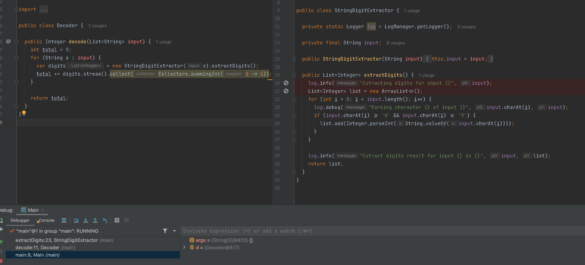
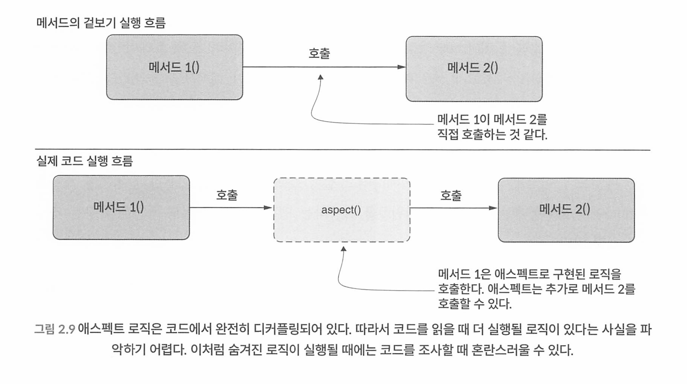
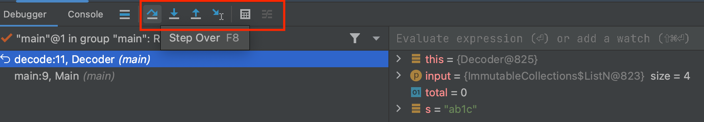
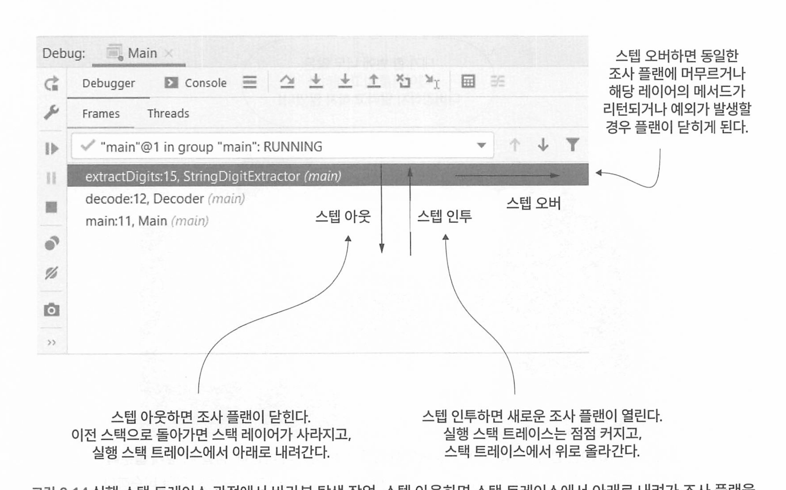

## CHAPTER 2 디버깅 기법으로 앱 로직 이해하기

### 2.1 코드 분석만으로는 불충분한 경우

### 2.2 디버거를 이용한 코드 조사

디버거를 언제 사용해야 할까? -> 지금 내가 조사하려는 로직을 먼저 파악한다. 어느부분에서 조사를 원하는지를 먼저 파악해야 한다. 

디버거 없이 먼저 코드를 읽고 이해할 수 있는지 확인하고 문제가 되는 지점부터 디버깅을 시작하는것이 좋다.

그래야 디버거 없이도 어떤 로직이 무슨일이 일어나는지 알수 있으므로 시간이 절약된다.

* 코드의 맥락, 어떤기능을 하는지 모르는데 디버거를 돌리면 무슨 소용이 있을까? 

#### 2.2.1 실행 스택 트레이스란 무엇이고 어떻게 사용해야 할까?

현재 실행 중인 점에서 프로그램의 호출 스택에 있는 모든 함수 호출 정보를 추적하는 기록.

스프링에서는 Aspect로 분리된 코드를 사용한 경우, 호출 체인목록에서 Aspect코드는 볼 수 없다. 

* 가장 아래 Main 클래스의 main 메서드가 Decoder의 decode()를 호출하고 다시 extractDigits()을 호출한다 

* 스택 트레이스의 맨 아래는 현재 스레드가 시장되기 시작한곳. 

**Apsect는 왜 디버깅하기 힘들까?**

그러나 Apsect 관련 클래스에 브레이크 포인트를 찍게 되면 해당 브레이크 포인트에 멈춘다. 

#### 2.2.2 디버거로 코드 탐색하기

다음은 디버거로 코드를 탐색하는 세 가지 기본 기술이다.

- 스텝 오버(step over): 동일한 메서드에서 다음 코드 라인으로 계속 실행한다.
  - 단축키 F8
- 스텝 인투(step into): 현재 라인에서 호출된 메서드 중 하나의 내부에서 실행을 계속한다.
  - 메서드의 내부 로직을 보고싶을때 사용 
  - 단축키 F7
- 스텝 아웃(step out): 조사하던 메서드의 나머지 부분을 실행하고, 호출한 상위  메서드로 실행을 되돌린다.
  - 현재 메서드의 호출 결과를 확인하고 싶을때 사용 
  - 단축키 Shift + F8

* 스텝 아웃시 이전스택으로 돌아가면서 현재 실행중이던 메소드의 스택 레이어가 사라진다.
* 스텝 인투시 메소드 내부 로직을 보여주므로 새로운 플랜이 생겨 스택 레이어가 많아진다.
* 스텝 오버시 해당 레이어가 종료되거나 예외가 발생할경우 플랜이 닫힌다. 

### 2.3 디버거로도 충분하지 않다면

성능 문제의 경우 디버거로 조사할 수 없는 특수한 종류의 문제다. 

또한 앱에 문제가 생겨 실행 중단된 경우 스레드 또는 힙덤프로 조사해야 한다. 