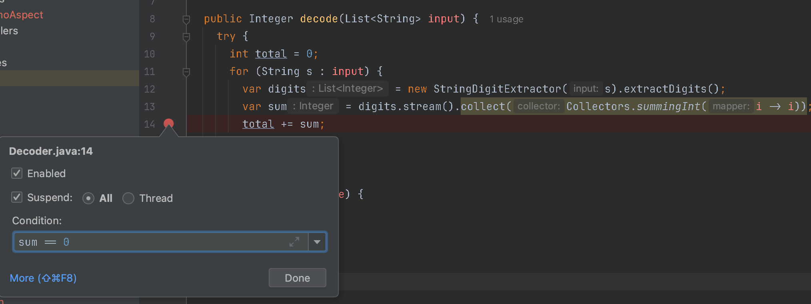
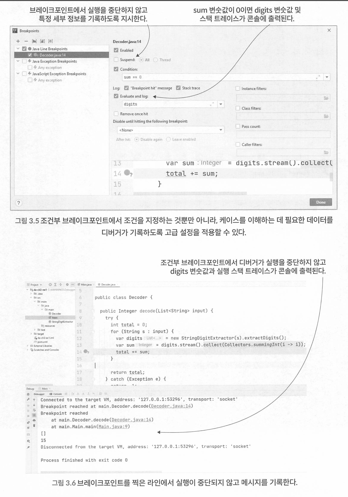
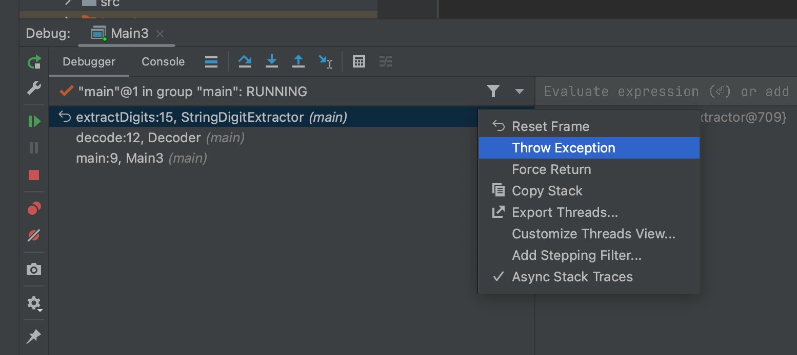

## CHAPTER 3 고급 디버깅 기법으로 문제의 근본 원인 찾기

### 3.1 조건부 브레이크포인트로 조사 시간 최소화

디버깅 중 특정 상황에서 조건을 만족할 때 브레이크가 걸리길 원한다면 조건부 브레이크 포인트를 쓸 수 있다.

조건부 브레이크 포인트를 걸려면 해당 조건은 true/false로 평가되는 표현식이어야 한다. 

브레이크포인트에 sum ==0이라는 조건식을 넣으면 디버거는 이에 따라 sum 변숫값이 0인 경우에 만 실행을 중단한다

> 만약 사용자 계정 상태 업데이트시 isActive 상태가 false로 바뀌는 시점을 디버깅 하고싶다면 ?

* 브레이크 포인트를 찍고 브레이크 포인트를 우클릭 해서 조건을 넣는다. 

  

### 3.2 실행을 중단시키지 않고도 브레이크포인트를 사용하는 방법

실행을 중단하지 않고 조건부 브레이크를 이용해서 메시지를 출력시킬 수 있다. 

디버거는 브레이크포인트를 찍은 라인에 닿을 때마다 메시지를 기록한다

### 3.3 조사 시나리오를 동적으로 변경하기

실행시간이 긴 프로세스의 문제점을 조사하는 경우나 실행이 매우 빠르지만 로컬환경에서만 재현할 수 없는경우에 해결할 수 있는 방법이 있다. - >원격 디버깅으로 가능 

### 3.4 조사 케이스를 되감기

실행한 코드를 디버거로 되돌릴 수 있다. 이를 execution frame dropping 이라고 한다 . 

실행 프레임을 드롭한다는 것은, 실행 스택 트레이스에서 한 레이어 뒤로 간다는 뜻이다. 

예를 들어, 어떤 메서드에 스텝 인투했다가 다시 되돌아가고 싶을 때, 실행 프레임을 삭제하면 메서드가 호출됐던 위치로 돌아가는 것이다.

현재 실행 프레임을 드롭하려면 실행 스택 트레이스에서 메서드 레이어를 선택하고 마우스 오른쪽 버튼을 클릭한 후 Reset Frame을 선 택한다.

앱의 내부 메모리 밖에서 값을 변경하는 커맨 드를 실행하면, 이를테면 다음과 같은 경우에는 프레임을 드롭해도 해당 변경분은 되돌릴 수 없다.

- DB에 있는 데이터를 수정한다(INSERT, UPDATE, DELETE).
- 다른 Rest API를 호출한다. 
- 파일 시스템을 변경한다(파일 생성, 삭제, 변경).
- 다른 앱을 호출하여 해당 앱의 데이터를 변경한다.
- 다른 앱이 읽는 큐에 메시지를 추가해서 해당 앱의 데이터를 변경한다.
- 이메일 메시지를 전송한다.