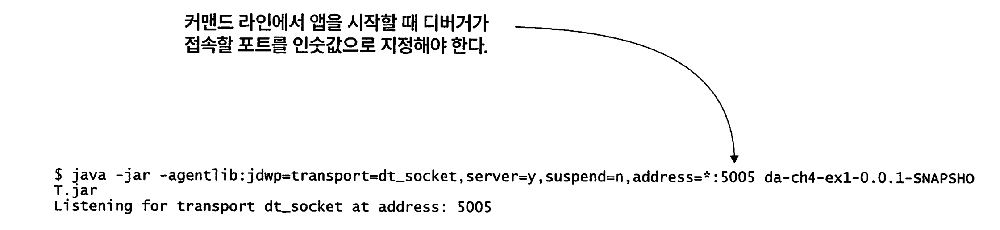
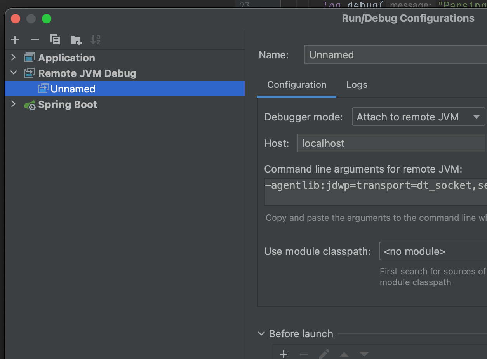

## CHAPTER 4 원격 앱 디버깅

### 4.1 원격 디버깅이란?

앱을 배포하면 환경이 매우 다르다. (개발, 스테이징 운영)

이럴때 문제가 생기면 조사하기 힘들다. 이때 원격 디버깅을 이용해서 문제를 추적할 수 있다.

* 그러나 프로덕션에서는 원격 디버깅을 사용해서는 안된다. 

원격 디버깅 사용시 agent라는 소프트웨어를 앱에 부착해야하는데 다음과 같은 문제가 발생할 수 있으므로 프로덕션에서는 주의해야 한다.

- 에이전트 때문에 앱 실행 속도가 느려질 수 있다. 속도가 느려지면 예기치 않은 성능 문제가 발 생할 수 있다.
- 에이전트가 디버거 도구와 통신하려면 네트워크를 통해야 하는데, 특정 포트를 오픈하는 과정 에서 보안 취약 요소가 발생할 수 있다.
- 앱의 어떤 부분을 다른 곳에서 동시 사용 중일 경우, 해당 코드를 디버깅하면 전체적인 기능에 간섭을 일으킬 수 있다.
- 디버깅을 하다가 앱이 무한정 차단돼서 프로세스를 재시작해야 할 때도 있다.

### 4.2 원격 환경에서 조사하기

#### 4.2.1 시나리오

UAT (유저 인수테스트 환경) 환경에서 API 호출시 응답코드는 200이지만 앱은 아무 데이터를 리턴하지 않는문제. 

#### 4.2.2 원격 환경의 문제 조사하기

원격 디버깅할 앱은 커맨드라인에서 앱 실행시 -agentlib:jdwp 매개변수를 추가하여 디버거 에이전트를 연결시켜야 한다.

디버거 에이전트는 서버처럼 작동하면서 디버거 도구가 설정된 포트에 접속해서 디버깅 작업을 수행할 수 있다.

```shell
java -jar -agentlib:jdwp=transport=dt_socket,server=y,suspend=n,address=*:5005 app.jar
--------------------
- agentlib:jdwp : jdwp 에이전트를 통해 디버거와 통신채널을 연다
transport=dt_socket : 앱과 디버거 TCP/IP 통신을 한다
server=y : 디버거를 리스닝 하는 앱에 에이전트를 부착한다
suspend=n : 디버거가 부착되길 기다리지않고 앱을 바로 실행시킨다
address=*:5005: 에이전트가 디버거와 통신하기 위해 여는 포트 정의한다 
```


실행시 에이전트 5005를 리스닝중이라는 메시지가 출력된다.



Intelli) 환경에서 원격 앱에 디버거로 접속하는 방법을 알아보자. 원격 환경에서 실행 중 인 앱에 디버거로 접속하는 절차는 다음과 같다.

1. 실행 구성(running configuration)을 새로 추가한다. 구성 항목중에서 Remote JVM Debug를 선택한다




2. 디버거 에이전트의 원격지 주소(IP 주소 및 포트)를 설정한다

3. 앱 디버깅을 시작한다

이후 디버깅 사용법은 나머지와 같다.

* 그러나 그 코드가 그사이에 변경 추가 삭제 되었을지도 모르고 버전이 다를수도 있다.
* 디버거 화면에 빈 라인 또는 메서드나 클래스 밖 라인까지 탐색할 수도 있다. 스택트레이스도 다를 수 있다.

우리가 앞서 의심하던 이상한 api를 호출하고 브레이크 포인트를 찍어서 추적한다. 