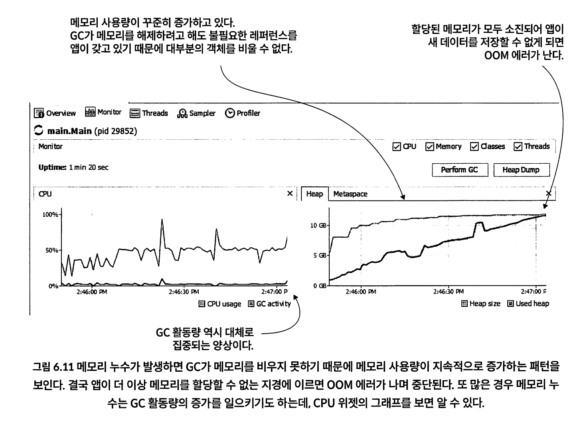

## CHAPTER 6 프로파일링 기법으로 리소스 사용 문제 파악하기

프로파일러는 실행중인 JVM 프로세스를 가로채서 다음 세부정보를 제공한다.

* CPU와 메모리 같은 리소스가 앱에서 어떻게 소비되는가?
* 실행 중 스레드와 현재 상태는 어떤가
* 실행 중인 코드 및 특정 코드 조각에서 사용하는 리소스는 무엇인가. 

### 6.1 프로파일러는 어떤 경우에 유용할까?

* 비정상적인 리소스 사용량 식별
* 코드의 어느 부분이 실행되는지 찾기
* 앱 실행 속도가 저하되는 문제 파악 

#### 비정상적인 리소스 사용량 식별

리소스가 비정상이면(OOM, 앱 다운) 다음을 의심해볼 수 있다.

* 스레드 문제 : 동기화가 결여되어있거나 동시성문제
  * 스레드 생성하는것도 비용이다. 실제로 윈도우는 1MB 리눅스 유닉스는 2MB다. 이때 스레드 덤프를 이용해 추적해야 한다. 
* 메모리 누수 : 메모리를 수거하지 못하여 앱이 죽는 문제 
  * 객체 레퍼런스를 붙들고 있으면 GC가 수거하지 못하므로 메모리가 부족하게 되어 결국 앱은 죽는다

### 6.2 프로파일러 사용 방법

#### 6.2.1 VisualVM 설치 및 구성

mac os 기준 : https://visualvm.github.io/download.html

* https://zzang9ha.tistory.com/386

```
인텔리제이 VisualVM 설치하기

1. Settings - Plugins - VisualVM 검색 후 Install


2. Settings - VisualVM Launcher 설정 이동

VisualVM executable path 설정 : VisualVM 설치한 경로에 visualvm 프로그램 선택
Custom JDK home path 설정 : JDK 설치되어 있는 경로 선택

각각 Run 과 Debug 아이콘으로 애플리케이션을 실행하면 VisualVM이 실행된다.
```

#### 6.2.2 CPU와 메모리 사용량 관찰


#### 6.2.3 메모리 누수 현상 식별



* List에 계속 객체를 추가해서 GC가 객체를 회수하지 못하고 OOM을 발생시키는 예제

OOM을 방지하는 방법 중 하나는 자바 앱에 할당하는 힙 크기를 조정하는것이다. 최대 힙 크기는 JVM 실행옵션의 -Xmx1G(2G, 4G도 가능)을 주면 된다. -Xms는 최소 힙크기를 줄 수 있다. 


힙 외에도 메타스페이스(클래스 메타데이터가 저장되는 공간)에서도 OOM이 발생할 수 있다. 자바 리플렉션을 사용하는 다이나믹 프록시 등을 사용하다보면 이런문제가 발생할 수 있다. 

메타스페이스도 힙처럼 크기를 지정할 수 있다(-XX:MaxMetaspaceSize=100M)