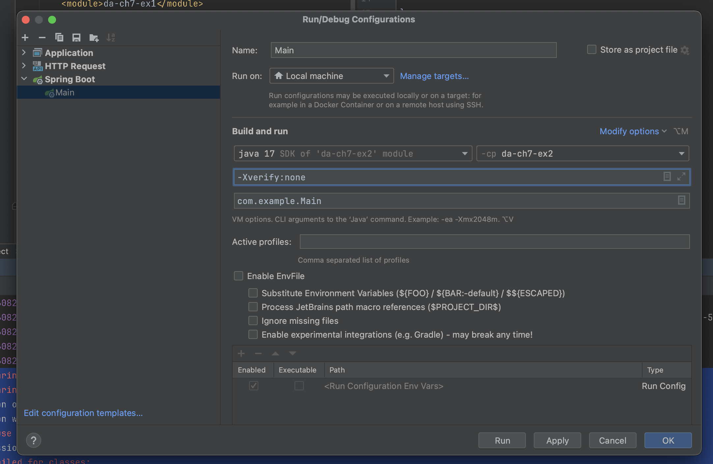
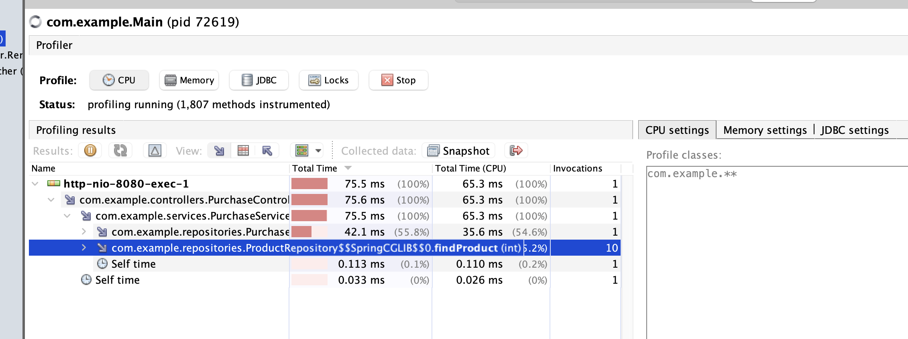
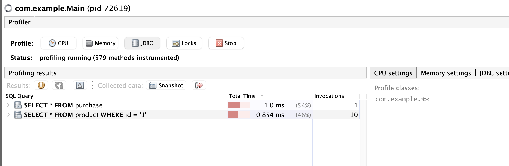
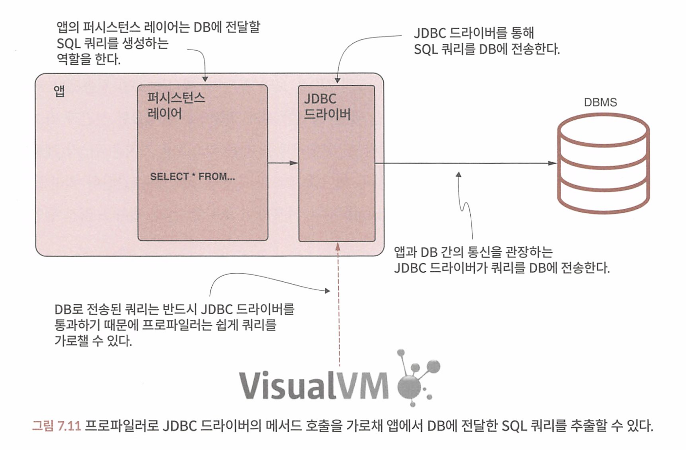

## CHAPTER 7 프로파일링 기법으로 숨겨진 이슈 찾기

중요한 프로파일링 기법 3가지

- 샘플링을 통해 앱 코드의 어떤 부분이 실행되는지 확인한다.
- 실행을 프로파일링(인스트루멘테이션(instrumentation)이라고도 한다)하여 잘못된 부분을 찾아내 최적화한다.
- 앱을 프로파일링하여 DB와 통신하는 SOL 쿼리를 식별한다(DBMS).


ex) 외부 에이피아이 호출에 오래걸릴때.

* 예제 da-ch7-ex1



애플리케이션 실행시 Append JVM parameter `-Xverify:none` to application 해야 에러 안남.

* https://visualvm.github.io/troubleshooting.html

```
CPU Profiling Fails With "Redefinition failed with error 62"
Description: CPU profiling in the Profiler tab or using the Startup Profiler plugin fails, VisualVM displays message "Redefinition failed with error 62".
Resolution:  Restart the application with the VM argument -Xverify:none to disable classfile verification. You must restart the application to disable classfile verification. You cannot disable verification if the application is running.
```


### 7.1 샘플링으로 실행되는 코드 관찰

1. visual vm을 시작한다.

프로세스 (메인 클래스)를 선택하고 우측 Sampler 탭에서 샘플링을 시작한다.


실행을 샘플링하는 목적은 세 가지다.

- 어떤 코드가 실행되는지 알아낸다: 샘플링을 수행하면 백그라운드에서 어떤 코드가 실행되는지 알 수 있다. 
- CPU 사용량 파악하기: 레이턴시 문제를 조사하면서 어떤 메서드가 실행 시간을 공유하는지 파악한다.
- 메모리 소비량 파악하기: 메모리와 관련된 문제를 분석한다. 메모리 샘플링과 프로파일링은 11장 에서 자세히 설명한다.


2. CPU 버튼을 클릭하여 성능 데이터 샘플링을 시작하면 전체 액티브 스레드 리스트와 해당 스택 트 레이스가 표시된다(그림 7.4). 프로파일러는 프로세스 실행을 가로채서 모든 호출된 메서드와 그 대략적인 실행 시간을 표시한다. 

3. / demo 엔드포인트를 호출해서 실행된 스레드를 보면 어떤 코드가 호출되었는지 아주 자세하게 나온다. 이들을 하나씩 열어보면 무슨일을 하고 무엇을 호출하는지 알 수 있다. 


### 7.2 프로파일링으로 메서드의 실행 횟수 파악

샘플링을 해도 메서드 호출 횟수는 알 길이 없다.

앱을 한번 실행하는 데 50밀리초밖에 안 걸려도 1,000회 호출해서 샘플링하면 50초가 걸린다.


프로파일링은 리소스가 많이 소모되는 작업이므로 정말 성능이 좋은 시스템이 아닌 한, 만사를 프로파일링하려면 엄청난 시간이 소요될 것이다. 따라서 항상 먼저 샘플링부터 해본 후에 프로파일링 대상을 식별하는 것이 합리적이다.


작은 예제라면 별 문제가 아니겠지만, 규모가 큰 앱에서 프로파일링할 때에는 가급적 가로챌 코드의 범위를 제한하라


코드 범위를 제한하는 방법이다. Profiler 탭의 우측에서 앱의 어느 부분을 가로챌지 지 정한다. 이 예제는 다음과 같이 지정하겠다.

- co.example. t*: con. example 이하 모든 패키지에 속한 코드
- feign.**: feign 이하 모든 패키지에 속한 코드

패키지와 클래스를 필터링하는 구문은 다음과 같이 몇 가지 간단한 규칙을 갖고 있다.

- 각 규칙마다 별도의 라인에 작성한다.
- 싱글 애스터리스크(*)는 패키지를 가리킨다. 예를 들어, com. exampLe.*는 com. examp1e 패키지 의 모든 클래스를 프로파일링 대상으로 지정한다는 뜻이다.
- (``**``)는 패키지와 그 하위 패키지를 모두 가리킨다. 예를 들어 com. example.``**`` 는 com. example 패키지의 모든 클래스와 그 하위 패키지를 의미한다.

* 어떤 클래스 하나만 프로파일링하려면 클래스 풀 네임을 지정한다. 예를 들어 com. example.controllers.DemoController는 DemoController 클래스 하나만 대상으로 한다.


어떤 메소드를 호출하고 무슨 문제가 있는지 다 알수있다. 


### 7.3 프로파일러로 앱이 실제로 실행하는 SQL 쿼리 파악

예제 프로젝트 da-ch7-ex2

앱을 시작하고 CURL이나 포스트맨으로 /products 엔드포인트를 호출한다.



* Productservice 클래스의 getProductNamesforPurchases() 메서드는 PurchaseRepository 클래스의 findA11 ( 메서드를 호출한다.

* ProductService 클래스의 getProductNamesForPurchases() 메서드는 ProductRepository 클래스의 **findProduct()를 10번** 호출한다. (문제 지점 발견 )

> 반드시 샘플링을 먼저 하고 프로파일링을 할것. 

프로 파일러를 사용하면 앱이 DB에 보낸 모든 SOL 쿼리를 알아낼 수 있다. 

CPU 버튼 대신 JDBC 버튼을 클릭하면 SQL 쿼리를 프로파일링할 수 있다.



> 앱이 JDBC 드라이버를 통해 DB에 전달한 SOL 쿼리를 프로파일러가 가로채 보여주므로 앱의 어떤 코드가 어떤 쿼리를 몇 번 실행하는지 쉽게 파악할 수 있다.



* 굿.. 여러번 호출하면 호출한만큼 invocation이 늘어난다 

위 문제는 조인으로 해결할 수 있게 되었다. 

#### 7.3.1 프로파일러로 프레임워크에서 생성되지 않은 SQL 쿼리 식별

JPA의 쿼리도 가로채서 확인할 수 있다. 

경험상 퍼시스턴스 프레임워크가 일으키는 대부분의 문제는 다음과 같이 정리할 수 있다.

- 레이턴시를 유발하는 느린 쿼리: 프로파일러로 실행 시간을 조사하면 쉽게 찾아낼 수 있다.
- 프레임워크가 생성한 다수의 불필요한 쿼리: 개발자 사이에서는 N+ 1 쿼리 문제로 더 잘 알려져 있다. 이 역시 프로파일러를 사용해서 쿼리 실행 횟수를 알 수 있다.
- 잘못된 앱 설계로 발생한 긴 트랜잭션 커밋: CPU를 프로파일링하면 쉽게 발견된다.

아래 properties 옵션을 주면 쿼리를 로그에 출력할 수 있다.

```
spring.jpa.show-sql=true
spring.jpa.properties.hibernate.format_sql=true
logging.level.org.hibernate.type.descriptor.sql=trace
```


> 레이턴시 문제를 조사할 때는 언제나 프로파일러로 시작하는 것이 좋다. 첫 번째 단계는 샘플링이다. sQL 쿼 리 문제가 의심된다면 JDBC에 관한 프로파일링을 수행하라. 문제를 쉽게 이해할 수 있고 필요하다면 디버거나 로그를 사용하여 여러분의 추측을 굳힐 수 있다.

### 요약


- 프로파일러는 앱의 실행을 가로채서 각 스레드의 실행 스택 트레이스, 각 메서드의 실행 시간, 특정 메서드의 호출 횟수 등 실행 중인 코드에 관한 필수 세부 정보를 제공한다.
- 지연 시간 문제를 조사할 때 프로파일러를 사용하는 첫 번째 단계는 샘플링이다. 샘플링은 프로파일러로 많은 세부 정보를 얻지 않고 실행 중인 코드를 가로채는 방법으로, 리소스 소모가 적고 실행의 큰 그림을 그려볼 수 있다.
- 샘플링은 세 가지 필수 세부 정보를 제공한다.
  - 실행되는 코드: 문제를 조사할 때 코드의 어떤 부분이 실행되는지 모를 때가 있는데, 샘플링으로 어느 코드가 실행되는지 파악할 수 있다.
  - 각 메서드의 총 실행 시간: 이 정보를 보면 코드의 어떤 부분이 잠재적인 레이턴시 문제를 일으키는지 짐작할 수 있다.
  - 총 CPU 실행 시간: 코드가 실행 시간을 '작동'하는 데 쓰는지, 아니면 '대기'하느라 낭비하는지 알 수 있다.
- 샘플링만으로도 문제의 원인을 파악하기에 충분하지만 대부분 더 자세한 정보가 필요하다. 실행을 프로파일링하면 보다 구체적인 세부 정보를 얻을 수 있다.
- 프로파일링은 리소스를 많이 소모하는 프로세스다. 실제 앱이라면 전체 코드베이스를 프로파일링한다는 것은 사실상 불가능하기 때문에 프로파일링을 수행하기 전에 조사에 집중할 패키지와 클래스를 필터링해야 한다. 대개 먼저 실행을 샘플링하면 앱의 어느 부분에 집중하는 게 좋을지 알 수 있다.
- 프로파일링으로 얻을 수 있는 필수 세부 정보는 메서드의 호출 횟수다. 샘플링을 해도 메서드의 총 실행 시간은 알 수 있지만, 얼마나 자주 호출되었는지는 모른다. 호출 횟수는 너무 느리거나 잘못 사용되고 있는 메서드를 찾아내는 데 중요한 정보다.
- 앱이 DB로 전송한 SQL 쿼리는 프로파일러로 가로채 가져올 수 있다. 프로파일러는 앱의 퍼시스턴스 레이어 구현에 쓰인 기술과 무관하게 모든 쿼리를 가로챈다. 이 기능은 퍼시스턴스 프레임워크(예: 하이버네이트) 기반으로 DB와 연동되는 앱에서 느린 쿼리를 찾아낼 때 매우 유용하다.