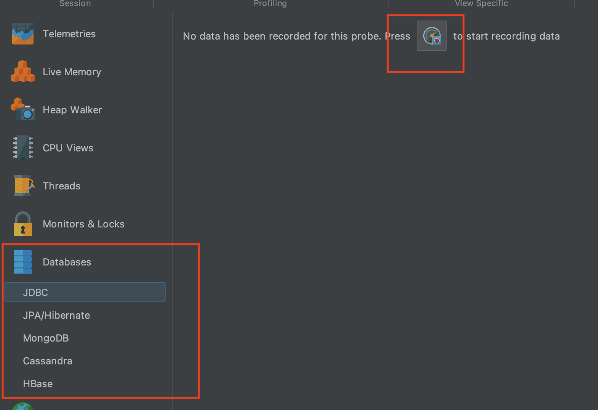
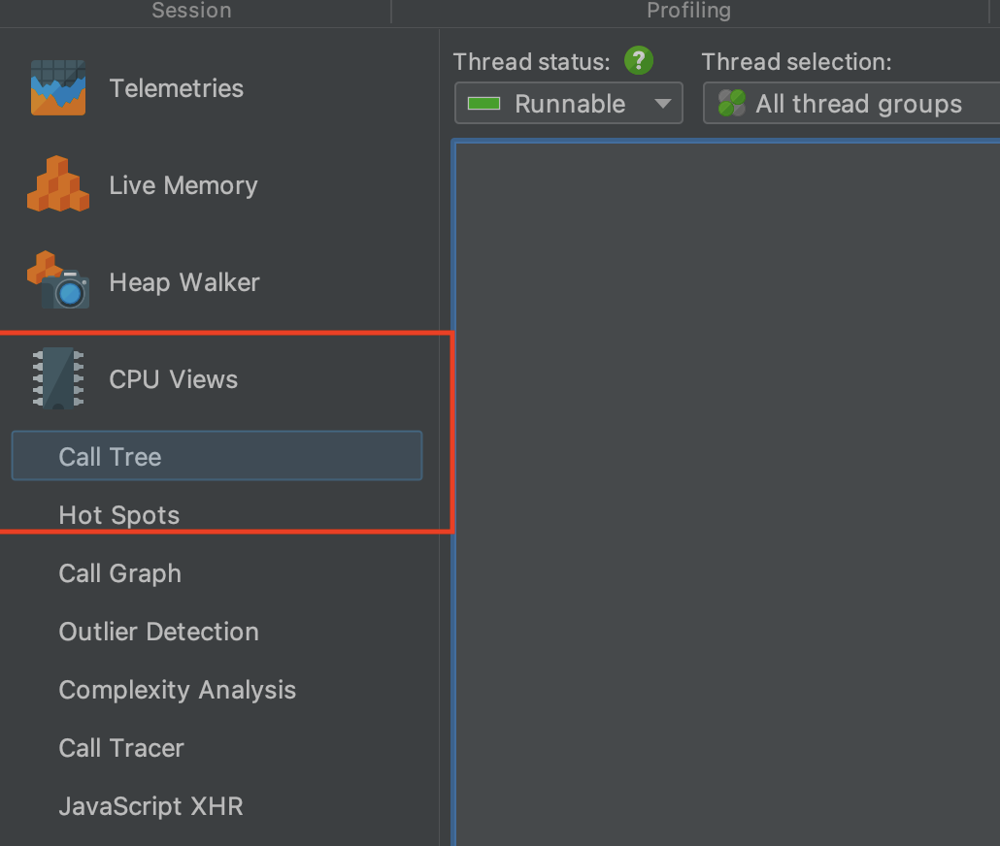
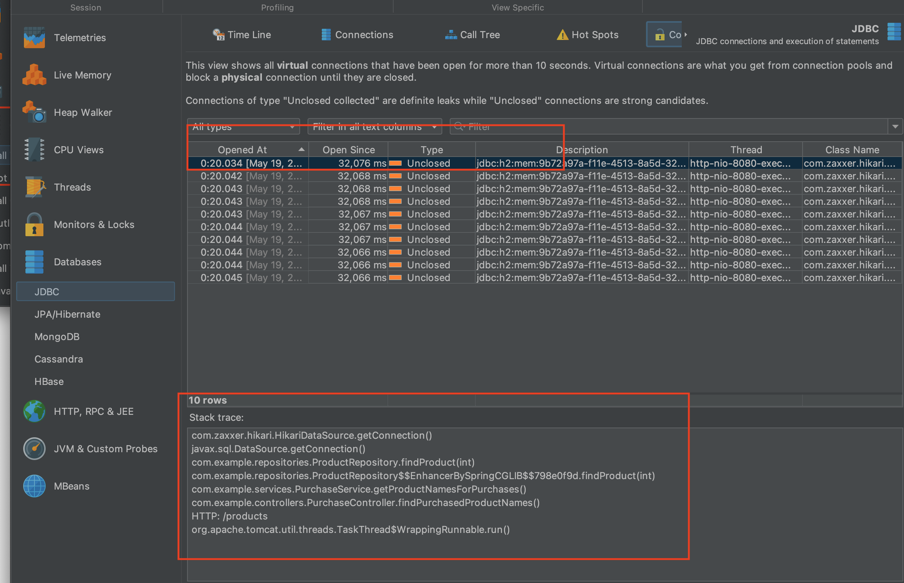
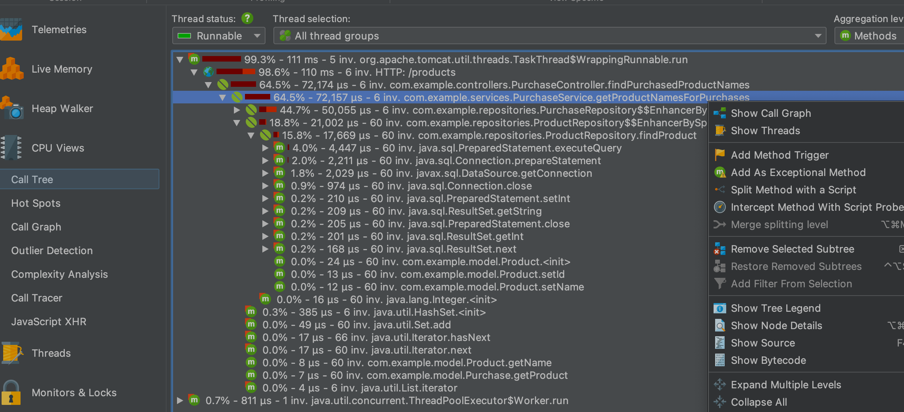
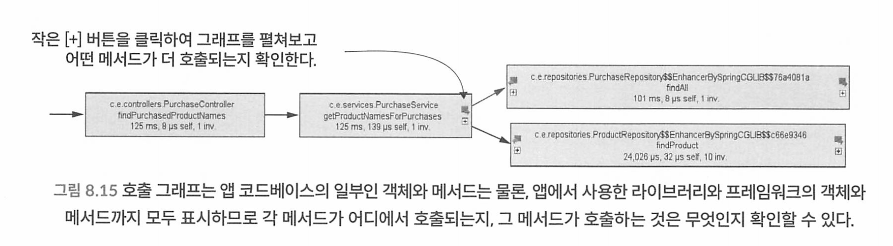

## CHAPTER 8 프로파일링한 데이터에 고급 시각화 도구 적용하기

- 관계형 DB 커넥션 문제 감지
- 호출 그래프를 그려 앱 설계를 더 빠르게 이해
- 플레임 그래프로 앱 실행을 좀 더 쉽게 시각화
- 앱이 NoSOL DB 서버에 보낸 쿼리 분석

실행 스택의 또 다른 표현 형태인 플레임 그래프(flame graph)를 소개한다. 플레임 그래프 역시 앱의 실행을 시각화하는 방법으로, 실행된 코드와 실행 시간을 나타낸다. 동일한 데이터도 다른 관점에서 보면 원하는 바를 더 쉽게 얻게 되는 경우가 있 다. 플레임 그래프는 앱 실행을 다른 시각에서 바라보고 잠재적인 레이턴시 및 성능 문제를 식별 하는 데 유용하다.

### 8.1 JDBC 접속 문제 감지

커넥션을 연결해놓고 해제하지 않아서 누수가 생기는 예제.

샘플링으로부터 시작하고, 이후 프로파일링을 진행하는 것이 좋다.

DB 커넥션 문제의 원인은 다음 둘 중 하나일 것이다.

- 인프라 또는 네트워킹 문제로 앱과 DB 간 통신이 실패한다.

- 다음과 같은 이유 때문에 DB가 앱에 커넥션을 제공하지 않는다.

    - 인증이 실패했다.

    - DB가 줄 수 있는 커넥션을 다 써버렸다.

VisualVM만으로는 JDBC 커넥션을 명확하게 조사할 수 없으므로 JProfilerrㅏ 필요하다 

* 다운로드 : https://www.ej-technologies.com/download/jprofiler/files
* 유료임. 10일 무료 사용가능. 

설치후

1. 좌측 Start Center를 클릭해서 자바 프로세스에 프로파일러를 붙인다 
2. StartCenter 클릭후 QuickAttach 클릭 후 com.example.Main 선택 
3. Start를 누르고 JDBC 커넥션에 대한 세부 정보를 얻을것이므로 인스트루멘테이션(프로파일링)을 선택한다 
4. 좌측의 Databases -> JDBC를 선택하여 실행한다 -> 



5. 요청을 두번 보내본다.
6. HikariPool-1 - Connection is not available, request timed out after 30007ms.가 발생한다. 

7. Connections 탭에서 생성된 커넥션을 본다. 응답한 후에도 커넥션이 닫혀있지 않다. 

커넥션 리크를 일으킨 코드를 어떻게 찾아낼까? 

JProfiler의 CPU 프로파일링 기능을 켜고 다시 앱 을 실행하면 커넥션마다 자신을 생성한 메서드를 추적할 수 있는 스택 트레이스가 표시된다





기존 커넥션 릭을 일으키는 코드를 커넥션을 닫아주도록 수정해보자

before

```java
public Product findProduct(int id) throws SQLException {
  String sql = "SELECT * FROM product WHERE id = ?";
  Connection con = dataSource.getConnection();
  try (PreparedStatement statement = con.prepareStatement(sql)) {
    statement.setInt(1, id);
    ResultSet result = statement.executeQuery();
    if (result.next()) {
      Product p = new Product();
      p.setId(result.getInt("id"));
      p.setName(result.getString("name"));
      return p;
    }
  }
  return null;
}
```

after

```java
public Product findProduct(int id) throws SQLException {
  String sql = "SELECT * FROM product WHERE id = ?";
  
  try (
      Connection con = dataSource.getConnection();
      PreparedStatement statement = con.prepareStatement(sql)) {
    statement.setInt(1, id);
    ResultSet result = statement.executeQuery();
    if (result.next()) {
      Product p = new Product();
      p.setId(result.getInt("id"));
      p.setName(result.getString("name"));
      return p;
    }
  }
  return null;
}
```

이제 여러번 호출해도 Connection Leaks 탭에는 아무것도 없다.

### 8.2 호출 그래프를 보고 앱의 코드 설계 파악

CPU Views를 활성화 하고 Call Tree에서 특정 스택의 우클릭 후 Show Call Graph 하면 호출 그래프를 볼 수 있다.





### 8.4 NoSQL DB에서의 쿼리 분석

몽고디비, 카산드라, 레디스, Neo4je등 모두 분석이 가능하다. 


몽고디비 docker-compose

```
version: '3.8'
services:
  mongo1:
    image: mongo:latest
    hostname: mongo1
    container_name: mongo1
    restart: always
    environment:
      - MONGO_INITDB_ROOT_USERNAME=root
      - MONGO_INITDB_ROOT_PASSWORD=example
    ports:
      - 27017:27017
    volumes:
      - ./Users/ysk/db/mongo/data:/data/db
      - ./mongodb.key:/etc/mongodb.key
```

몽고디비도 마찬가지로 이벤트마다 관련된 스택 트레이스를 분석해서 트러블 슈팅을 할 수 있다.

