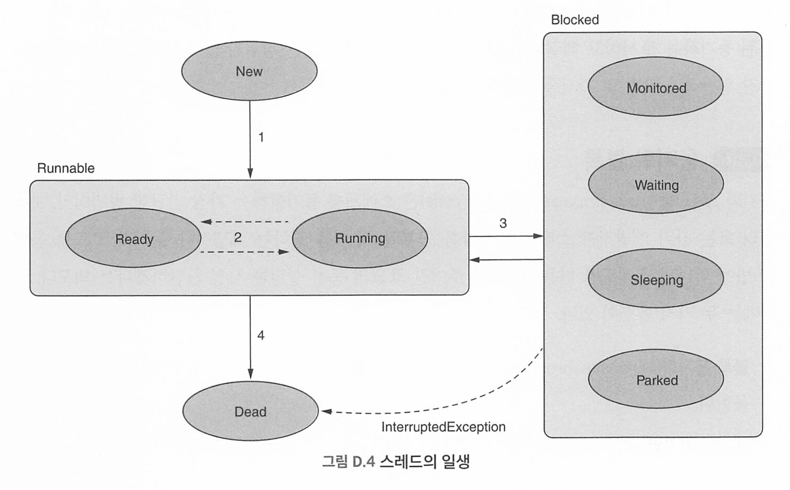
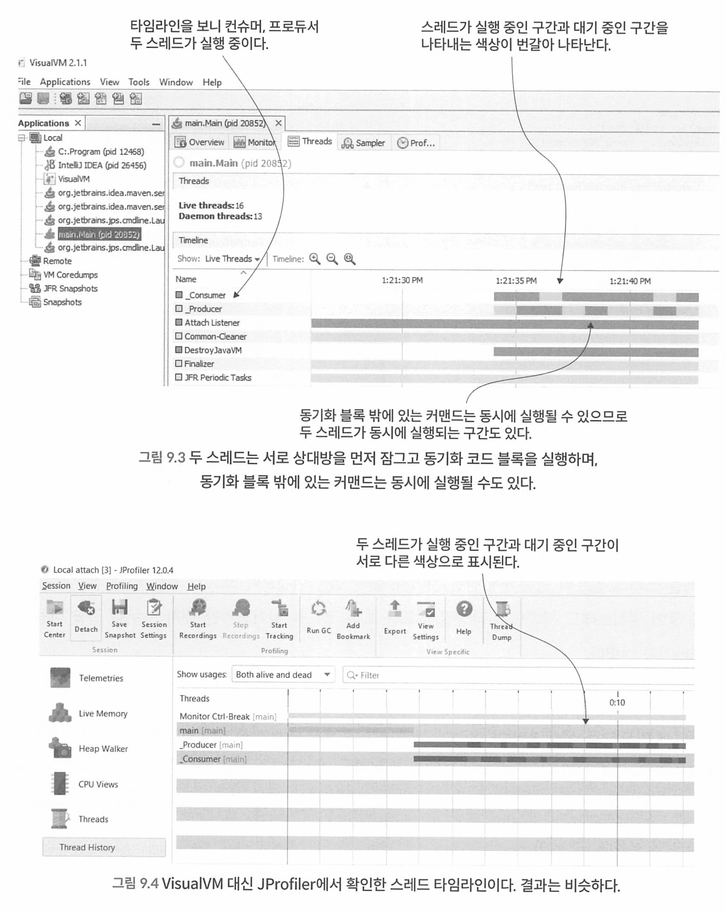
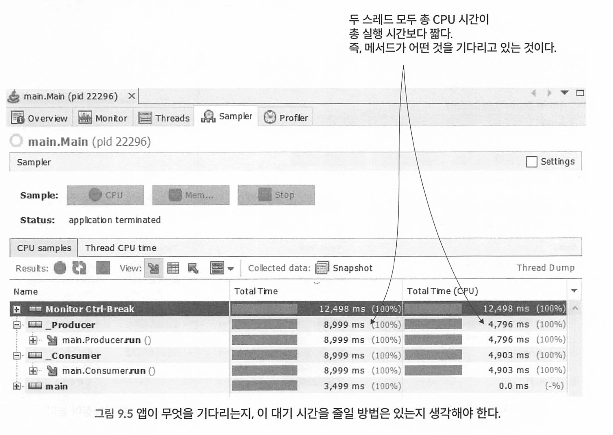

먼저 부록 D를 읽어볼것 

### 스레드의 수명 주기

**New(시작)**: 인스턴스화 직후(시작되기 전) 스레드의 상태다. 이 상태에서 스레드는 단순 자바 객체로, 앱은 아직 스레드에 정의된 커맨드를 실행할 수 없다.

**Runnable(실행 가능)**: start() 메서드가 호출된 이후다. JVM은 스레드에 커맨드를 실행할 수 있으며, 다음 두 하위 상태(substate) 중 하나로 만든다.

- **Ready(준비)**: 스레드는 실행되지 않지만 JVM은 언제라도 스레드를 실행할 수 있는 상태.
- **Running(실행 중)**: 스레드가 실행 중인 상태. 현재 CPU가 커맨드를 실행하고 있다.

**Blocked(차단됨)**: 스레드가 시작은 되었으나 일시적으로 실행 가능(runnable) 상태가 아닌 경우다. 따라서 JVM은 커맨드를 실행할 수 없다. 이 상태는 스레드를 실행할 수 없도록 일시적으로 JVM에서 스레드를 숨겨 스레드 실행을 제어하려고 할 때 유용하다. 차단된 상태에서 스레드는 다음 하위 상태 중 하나에 있다.

- **Monitored(모니터링됨)**: 스레드가 동기화 블록(동기화 블록의 액세스를 제어하는 객체)의 모니터에 의해 중단되고 해당 블록을 실행하기 위해 해제를 기다리는 상태.
- **Waiting(대기 중)**: 실행 도중 모니터의 wait() 메서드가 호출되어 현재 스레드가 중단된 상태. notify() 또는 notifyAll() 메서드가 호출될 때까지 스레드는 차단된 상태를 유지한다.
- **Sleeping(잠자기)**: Thread 클래스의 sleep() 메서드가 호출되어 현재 스레드를 지정된 시간 동안 중단한다. 중단 시간은 sleep() 메서드에 인수값으로 전달한다. 이 시간이 경과한 후에는 스레드가 다시 실행 가능 상태가 된다.
- **Parked(파킹됨)**: 대기 중 상태와 거의 같다. 누군가 park() 메서드를 호출하면 현재 스레드는 이 상태로 바뀌며, 이후 unpark() 메서드가 호출될 때까지 계속 차단된다.

**Dead(종료됨)**: 스레드는 커맨드 집합을 실행 완료하거나, Error나 Exception 때문에 중단되거나 다른 스레드에 의해 중단될 경우 종료된다. 이렇게 한번 종료된 스레드는 재시작할 수 없다.



누군가 `start()` 메서드를 호출하면 스레드는 New에서 Runnable로 바뀐다.

Runnable 상태가 되면 스레드는 Ready와 Running 사이를 들락날락한다. 어떤 스레드를 언제 실행할지는 JVM이 결정한다.

다음과 같은 경우, 스레드는 Blocked 상태가 될 수 있다.

- `Thread` 클래스의 `sleep()` 메서드가 호출되어 현재 스레드가 일시적으로 차단된다.
- 누군가 `join()` 메서드를 호출하여 현재 스레드가 다른 스레드를 기다리게 만든다.
- 누군가 모니터의 `wait()` 메서드를 호출하여 `notify()` 또는 `notifyAll()` 메서드가 호출될 때까지 현재 스레드의 실행을 중단시킨다.
- 동기화 블록의 모니터는 다른 액티브 스레드가 동기화 블록의 실행을 마칠 때까지 스레드 실행을 중단시킨다.

스레드는 실행을 완료하거나 다른 스레드가 끼어들어 중단되면 Dead(종료) 상태로 바뀐다. Blocked에서 Dead로의 상태 전이는 JVM이 허용하지 않는다. 차단된 스레드를 다른 스레드가 끼어들면 `InterruptedException`이 발생한다.

### 스레드 동기화

1. synchronized block of code (동기화 블록)을 이용해서 한번에 하나의 스레드만 접근가능하게 할 수 있다.

- 블록 동기화(block synchronization): 주어진 코드 블록에 synchronized 수정자(modifier)를 적용한다.
- 메서드 동기화(method synchronization): 메서드에 synchronized 수정자를 적용한다.

모든 동기화 블록에는 두 가지 중요한 구성 요소가 있다.

- 모니터(monitor): 동기화 커맨드의 실행을 관장하는 객체
- 커맨드 블록(block of instruction): 동기화한 실제 커맨드

모니터는 스레드가 동기화 블록에 들어가면 모니터에서 락을 얻는다. 락을 가진스레드가 락을 해제할떄까지 다른 스레드는 동기화 블록에 들어갈 수 없다. 

여러 동기화 블록이 각각 다른 모니터 객체를 사용하면 해당 블록들은 동기화 되지 않는다. 즉. 동시에 실행될 수 있다. 

### wait(), notifyl), notifyAll() 사용

### `wait()`

- **설명**: 현재 스레드를 대기 상태로 전환시키며, 해당 스레드는 모니터 락(monitor lock)을 해제하고 다른 스레드가 모니터 락을 획득할 수 있도록 한다.

- **사용 상황**: 특정 조건이 충족될 때까지 스레드를 일시 중지시킬 때 사용된다. 주로 `synchronized` 블록 내에서 사용된다.

- 예제

  ```java
  synchronized (lock) {
      while (조건) {
          lock.wait();
      }
      // 조건이 충족되었을 때 실행되는 코드
  }
  ```

### `notify()`

- **설명**: 모니터 락을 소유한 스레드가 `wait()`로 대기 중인 스레드 중 하나를 깨운다. 깨운 스레드는 모니터 락을 다시 획득할 수 있을 때 실행을 재개한다.

- **사용 상황**: `wait()`로 대기 중인 스레드를 하나만 깨워야 할 때 사용된다. 주로 `synchronized` 블록 내에서 사용된다.

- 예제

  ```java
  synchronized (lock) {
      lock.notify();
  }
  ```

### `notifyAll()`

- **설명**: 모니터 락을 소유한 스레드가 `wait()`로 대기 중인 모든 스레드를 깨운다. 깨운 스레드들은 모니터 락을 다시 획득할 수 있을 때 실행을 재개한다.

- **사용 상황**: `wait()`로 대기 중인 모든 스레드를 깨워야 할 때 사용된다. 주로 `synchronized` 블록 내에서 사용된다.

- 예제

  :

  ```java
  synchronized (lock) {
      lock.notifyAll();
  }
  ```

wait, notify, notifyAll은 동기화 블록에서만 사용할때만 효과가 있다.

* 이 메서드들이 객체의 모니터(lock)를 사용하여 스레드 간의 협력을 관리하기 때문
* 동기화 블록을 통해 객체의 모니터를 획득하지 않은 상태에서 이 메서드들을 호출하면 `IllegalMonitorStateException`이 발생

### 스레드와 블로킹 객체 동기화하기

JDK에는 스레드 동기화에 특화된 꽤 쓸 만한 도구 세트가 많다. 그중 멀티스레드 아키텍처에서 가 장 널리 알려진 클래스는 다음과 같다.

- Semaphore(세마포어): 주어진 코드 블록을 실행할 수 있는 스레드의 수를 제한할 의도로 사용하는 객체
- CyclicBarrier(사이클릭배리어): 주어진 코드 블록을 실행하기 위해 적어도 특정 개수 이상의 스레드가 액티브 상태인지 확인하는 용도로 쓰이는 객체
- Lock(락): 좀 더 광범위한 동기화 옵션을 제공하는 객체
- Latch(래치): 다른 스레드의 특정 로직이 수행될 때까지 일부 스레드를 대기시키는 목적으로 쓰 이는 객체

### 멀티스레드 아키택처의 문제점

다음과 같은 일반적인 문제를 미리 알아두면 더 빨리 원 인을 파악하고 해결하는 데 도움이 될 것이다.

- 경쟁 상태(race condition): 두 개 이상의 스레드가 공유 자원에 동시에 접근하고, 그 결과가 접근 순서에 따라 달라지는 상황. 이로 인해 데이터 일관성이 깨질 수 있다.
    - ex) arrayList의 갯수가 맞지않거나 재고 정합성이 깨짐 
- 데드락(deadlock): 두 개 이상의 스레드가 서로가 소유한 자원을 기다리면서 무한 대기 상태에 빠지는 상황. 스레드가 서로를 기다리기 때문에 작업이 진행되지 않는다. 
- 리브락(livelock): 두 개 이상의 스레드가 서로 상대방에게 자리를 양보하느라 실제로 아무 작업도 수행하지 못하고 계속 실행되는 상황
- 기아(starvation): 특정 스레드가 지속적으로 자원에 접근하지 못하고 다른 스레드에 의해 계속 차단되는 상황


### 9.1 스레드 락 모니터링

스레드 락은 다음과 같은 스레드 동기화 장치 때문에 발생한다.

* 한 스레드가 리소스를 변경하는 동안 다른 스레드가 리소스에 액세스하지 못하게 한다.
* 다른 스레드가 모두 완료되거나 특정 시점까지 실행된 이후에 특정 스레드의 작업을 재개한다. 

락을 잘못구현하면 성능이 떨어질 수 있으므로 주의해야 한다.


프로파일러로 락을 분석해서 스레드가 어떻게 작동하는지 알아 볼 수 있다.

* 어떤 스레드가 다른 스레드를 잠그는 것일까?
* 스레드가 잠긴 횟수
* 스레드가 실행되지 않고 중단된 시간 

VisualVm을 사용하여 스레드가 실행중인 코드를 보는 예제



### 9.2 스레드 락 분석

스레드 락을 사용하는 앱을 최적으로 구현했는지 확인하고 싶다면, 락을 식별해서 스레드가 차단된 횟수와 시간을 알 수 있는 수단이 필요하다.

프로파일링 절차는 7장에서 배운 것과 동일하다. (샘플링 후 프로파일링 )

1. 샘플링을 통해 앱 실행 중에 발생하는 일을 대략 이해하고 더 자세히 살펴보아야 할 부분이 어느 부분인지 파악한다.
2. 프로파일링을 수행하여 조사하려는 특정 주제와 관련된 세부 정보를 얻는다.



* 예제 사진을 보면, 메서드가 어떤 것을 기다린다면 CPU 시간이 총 실행보다 짧다 (CPU를 할당받지 못했으니까.)

만약 특정 코드의 실행시간을 분석했을 때, 실행 시간이 총 CPU보다 길다리면 어디선가 잠겨서 실행되지 못한것이다.

### 9.3 대기 중인 스레드 분석

대기중인 스레드 (wating thread)는 잠긴 스레드와 다르다. 

모니터는 동기화 코드(sync)블록을 실행하기 위해 스레드를 잠근다. 이때 모니터가 차단된 스레드에게 실행을 재개하라고 알려주긴 어렵다.

하지만 모니터가 스레드를 무한 대기시킨 다음 나중에 해당 스레드의 실행을 언제 재개할지 결정하도록 할 수도 있다.

대기중인 스레드는 처음에 자신을 무한 대기시킨 모니터로부터 알림을 받은 이후에만 다시 실행상태로 돌아갈것이다. 

* 모니터는 자바에서 동기화를 제공하는 기본적인 메커니즘이며, 객체단위로 존재하며 여러 스레드가 동시에 접근할 수 없는 코드 블록이나 메서드를 보호하며 한번에 하나의 스레드만 특정 코드블록을 실행할 수 있도록 보장한다.

>  스레드 A가 특정 작업을 수행하고, 그 결과가 준비될 때까지 스레드 B가 기다려야 하는 상황이다. 
>
>  스레드 B는 `wait()` 메서드를 호출해 스스로를 대기 상태로 만들고, 스레드 A가 `notify()` 또는 `notifyAll()` 메서드를 호출할 때까지 대기한다.

**대기중인 스레드가 다시 실행되는 과정**

1. **스레드가 대기 상태로 전환**:
   - 스레드가 `wait()` 메서드를 호출하면, 이 스레드는 해당 객체의 모니터를 놓고 대기 상태로 전환된다.. 이는 다른 스레드가 해당 객체의 모니터를 획득할 수 있게 한다.
2. **다른 스레드가 알림**:
   - 다른 스레드가 객체의 동기화 블록 내에서 `notify()` 또는 `notifyAll()` 메서드를 호출하면, 대기중인 스레드 중 하나(또는 모두)가 다시 실행 상태로 전환될 준비를 한다. 이 스레드는 모니터를 다시 획득해야 실행을 재개할 수 있다.

```java
class SharedResource {
    public synchronized void waitForNotification() throws InterruptedException {
        System.out.println("Thread " + Thread.currentThread().getName() + " is waiting.");
        wait();  // 현재 스레드를 대기 상태로 만듦
        System.out.println("Thread " + Thread.currentThread().getName() + " is notified and running.");
    }

    public synchronized void notifyThread() {
        System.out.println("Thread " + Thread.currentThread().getName() + " is notifying.");
        notify();  // 대기 중인 스레드 하나를 깨움
    }
}
```

* notfy()메서드는 반드시 sync 블록 또는 메서드 안에서 실행되어야 하며, 대기중인 스레드가 모니터를 얻게 되어 기회를 얻게 되는것이다 ( 바로 스레드가 실행하는것이 아님)


즉 잠긴 스레드와 대기중인 스레드의 차이는,

잠긴 스레드는 특정 리소스를 사용하려고 했지만 그 리소스가 잠금이 걸려 접근할 수 없는 상태의 스레드이며, 리소스를 사용할 수 있을떄까지 차단되어 대기하고

대기중인 스레드는 동기화 블록 내에서 wait()를 스스로 호출하여 스스로 대기상태로 전환되어서 다른 스레드가 notfy() 또는 notifyAll()로 깨울떄가지 대기한다.


> 동기화 블록의 스레드가 자연스럽게 잠겼다가 풀리도록 허용하는것이 wait(), notify()를 호출하는것보다 훨씬 빠르다