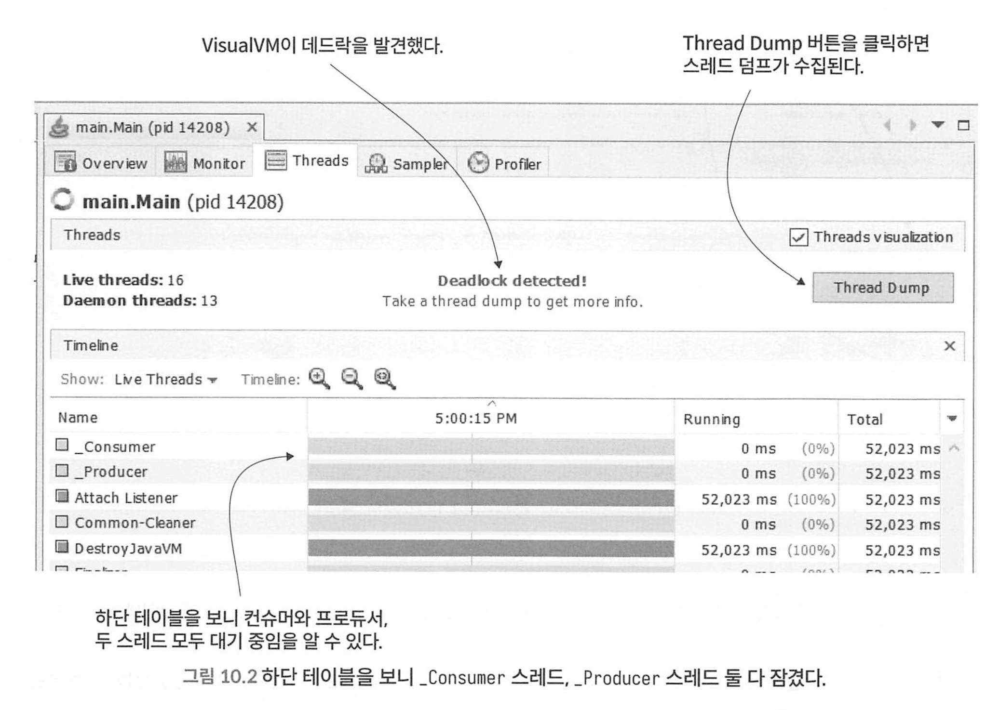
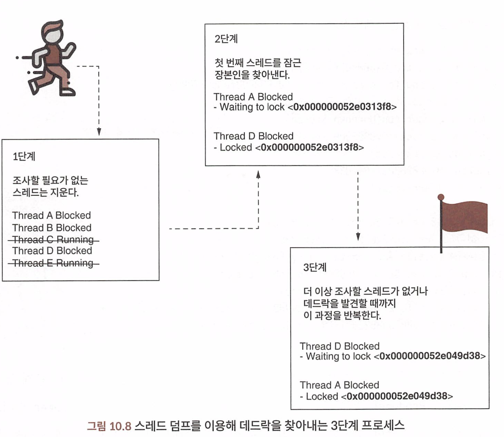
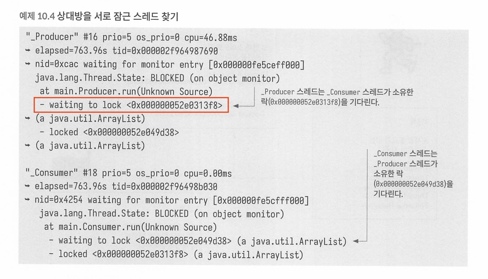
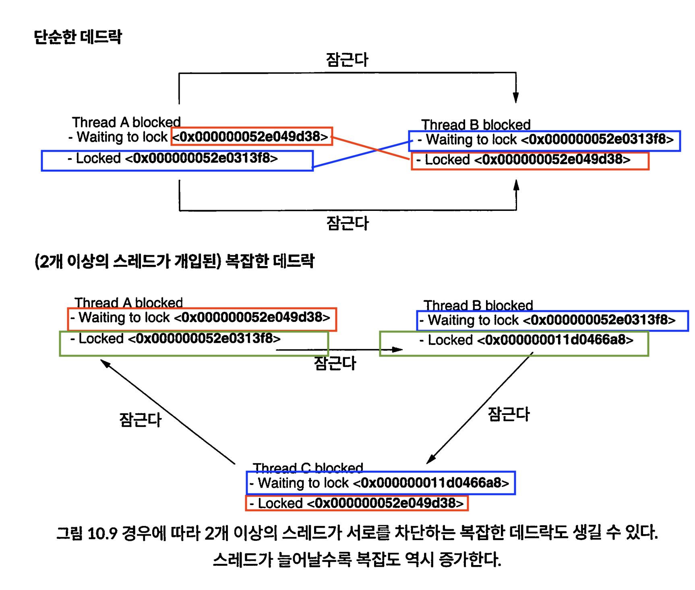

## CHAPTER 10 스레드 덤프로 데드락 문제 조사하기

데드락은 여러 스레드가 서로를 무한히 기다리며 아무도 실행되지 못하는 상황이다.

애플리케이션 데드락이 발생하면 프로세스가 멈춰버리기 때문에 샘플링이나 프로파일링 기법은 사용할 수 없다.

다만 스레드 덤프를 수집해서 조사할 수 있다. 

### 10.1 스레드 덤프 수집하기

예제 da-ch10-ex1 프로젝트


데드락을 감지하면 VisualVm이 데드락 감지를 알려준다.

ThreadDump 버튼을 누르면 덤프를 수집한다.



커맨드라인에서도 스레드 덤프를 수집할 수 있다.

```sh
1. 프로세스 아이디 찾기

jps -l

2. 스레드 덤프 가져오기
jstack <<PID>>
jstack 14208(jps -l 결과 프로세스 id)

3. visuamvm으로 스레드 덤프 파일 열어보기 (File > Load)
```

### 10.2 스레드 덤프를 읽는 방법

스레드 덤프 파일을 생성하면, 시각화 도구를 사용하지 않으면 텍스트 포맷 파일을 얻게된다. 

덤프가 만들어지는 시점에 앱에서 열심히 활동중인 스레드에 관한 세부 정보가 기록된것이다. 

스레드에 관하여 얻을 수 있는 주요 정보는 다음과 같다.

- 스레드명
- 스레드 ID
- 네이티브 스레드 ID
    - JVM 스레드는 운영체제 스레드를 래핑(플랫폼 스레드)한것이므로 백그라운드에서 실행중인 OS를 네이티브 스레드 ID(nid=0xcac)로 알 수 있다.
- 운영체제 레벨의 스레드 우선순위(priority): 스레드가 소비한 총 CPU 시간
- 상태 설명
    - waiting for monitor entry는 동기화 블록 입구에서 차단됏다는 뜻
    - time wating on monitor 지정된 시간동안 잠자고 있거나 실행 중 
- 상태명
- 스택 트레이스
    - 스레드별로 스텍 트레이스가 기록되어 있어 덤프 생성 시점에 어느 부분을 실행중인지 알 수 있다. 
- 스레드를 차단한 곳
- 스레드가 획득한 락
    - 어떤 락을 획득하고 어떤 락을 대기중인지 알 수 있다. 

```
// 스레드 덤프에 기록된 스레드의 내부 구조 
_Producer #16 prio=5 os_prio=8 cpu=46.88ms elapsed=763.965
    // 스레드 이름: Producer #16
    // 스레드 우선순위: 5
    // 운영체제 우선순위: 8
    // CPU 사용 시간: 46.88ms
    // 경과 시간: 763.965ms

    tid=0x0088024964987698 nid=0xcac waiting for monitor entry
    // 스레드 ID: 0x0088024964987698
    // 네이티브 스레드 ID: 0xcac
    // 모니터 엔트리를 기다리고 있는 상태

    java.lang.Thread.State: BLOCKED (on object monitor)
    // 스레드 상태: BLOCKED (객체 모니터에서 대기 중)
    
    at main.Producer.run(Unknown Source)
    // 스택 트레이스: main.Producer.run 메서드에서 대기 중

    - waiting to lock <0x0000000520313f8> (a java.util.ArrayList)
    // 잠금을 기다리고 있는 객체: java.util.ArrayList 인스턴스 (ID: 0x0000000520313f8)

    - locked <0x000000052049d38> (a java.util.ArrayList) // 스레드가 소유한 락 ID와 모니터 객체 타입
    // 현재 잠금 중인 객체: java.util.ArrayList 인스턴스 (ID: 0x000000052049d38)


```

데드락이 의심될 경우, 스레드가 유발한 락에 초점을 맞춰 조사해야 한다(그림 10.8).

1. 차단되지 않은 스레드를 모두 필터링하여 데드락을 일으킬 만한 스레드에 집중한다.
2. 첫 번째 후보 스레드(1단계에서 통과한 스레드)부터 차단을 일으킨 원인에 해당하는 락 ID를 찾아본다.
3. 락을 일으킨 스레드를 찾고 그 스레드를 차단시킨 대상을 체크한다. 이런 식으로 하다가 만약 처음 조사한 스레드로 돌아가면 지금까지 분석한 모든 스레드가 데드락에 빠진 것이다.





**1단계 : 잠기지 않은 스레드는 필터링한다**

먼저, 데드락을 일으킨 후보 스레드에만 집중할 수 있게 잠기지 않은 스레드는 모두 필터링한다. 

하나의 스레드 덤프에만 스레드가 수십 개는 등장할 텐데, 차단된 스레드에만 집중하려면 노이즈를 제거해야 한다.

**2단계: 첫 번째 후보 스레드를 가져와 그것을 차단시킨 스레드를 찾는다**

첫 번째 후보 스레드부터 해당 스레드를 대기시킨 ID를 찾아본다. 

[] 사이에 있는 스트링이 락 ID 다(예제 10.4에서 1 Producer"는 ID가 0x000600852e0313f8인 락을 대기한다).

**3단계 : 다음 스레드를 차단하는 스레드를 찾는다**

이 과정을 반복한다. 언젠가 이미 조사한 스레드에 도달하게 되면 데드락을 찾은 것이다.


2개 이상의 스레드가 데드락에 걸릴수도 있다.



* 진짜 코드를 잘못 작성한것. 

#### 10.2.2 도구를 활용하여 스레드 덤프 읽기

* https://fastthread.io/

위와 같은 도구도 있다. 

스레드 덤프 파일을 업로드하고, Analyze 버튼을 클릭하면 알아보기 쉬운 형태로 세부정보가 변환되어 스레드 분석에 용이하다

* 유료버전도있지만 무료도있다. 
* 데드락 감지, 스레드당 cpu 소비율, 플레임 그래프 등 여러 시각화를 제공 