## CHAPTER 11 앱 실행 중 메모리 관련 이슈 찾기 - 227

앱이 비효율적으로 메모리 관리를 수행하면 GC가 자주 발생하여 CPU 사용량이 증가하는 문제도 있다.

### 부록 E 자바 메모리 관리 체계

앱에 메모리를 할당하는 방법 3가지 - 스택, 힙, 메타 스페이스

* 스택 : 스레드가 로컬 변수와 해당 데이터를 저장하는 공간
* 힙 : 인스턴스가 저장되는 공간
* 메타스페이스 : 객체 타입의 메타 스페이스가 저장되는 공간

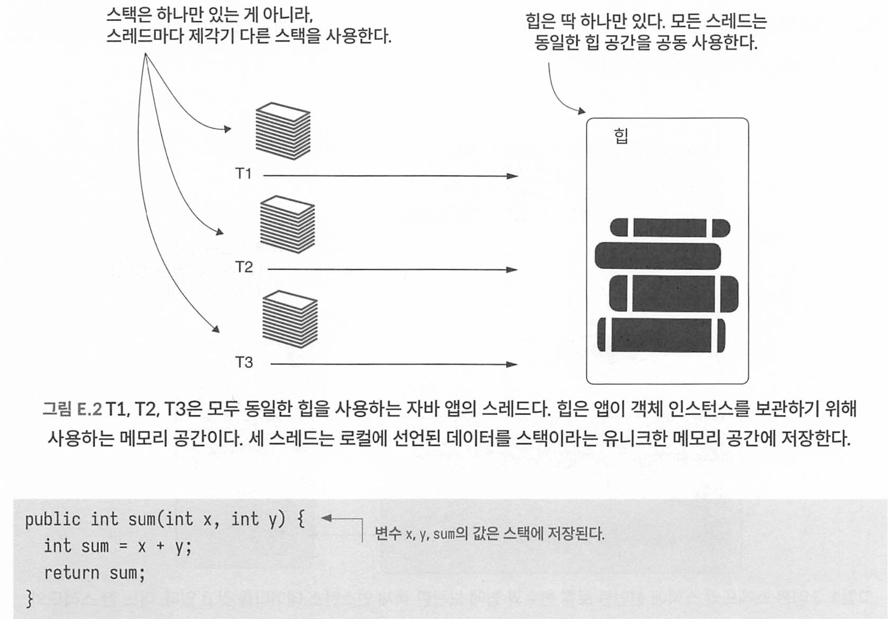

```java
public class Cat {
  String name;
  int age;
}
```

* new Cat으로 객체 생성시 힙에 저장된다

Cat 인스턴스를 가리키는 레퍼런스는 스레드 스택에 있는 변수 c에 저장된다.

```java
var c = new Cat();
```

#### 스레드가 로컬 데이터를 저장하는 데 사용하는 스택

변수 선언 혹은 메서드 호출 순서대로 스택에 쌓이게 되며, 메서드가 리턴되거나 예외가 발생시에 스택의 레이어와 그 내용물은 한번에 지워진다. 

스택이 가득차게되면 StackOverFlowError가 발생하고, 해당 에러가 발생한 스레드만 영향을 미치고 다른 스레드는 영향을 받지 않아서 프로세스는 실행을 계속할 수 있다. 

#### 앱이 객체 인스턴스를 저장하는데 사용되는 힙

힙은 자바 앱의 모든 스레드가 공유하는 메모리 공간이다.

힙 관련 문제는 원인을 찾기가 까다롭다. 객체가 힙에 어떻게 저장되는지, 누가 객체 레퍼런스를 갖고있는지 분석하기 어렵다.

OOM 에러는 문제가 없는 스레드에서도 발생할 수 있다. 스택과 달리 힙은 모든 스레드가 공간을 공유하기 때문이다. 

스택레이어의 레퍼런스 변수가 힙의 인스턴스를 가리키는데, 메서드가 종료되면 스택 레이어가 종료되면서 참조를 해제하면 해당 객체는 GC의 대상이 된다. 스택의 레이어가 삭제되지 않은체 계속 객체를 가리키면 메모리 누수로 이어진다. 


### 11.1 샘플링과 프로파일링으로 메모리 이슈 진단

트래픽이 많지 않은데 속도가 느리고, 메모리를 많이 사용한다면 GC때문에 속도가 느려진다고 볼 수 있다. 

앱이 상당히 많은 메모리를 사용하는것 같을때에는 어떻게 조사할 수 있을까?

1. 메모리를 샘플링하여 앱이 저장하는 객체 인스턴스에 관한 세부 정보를 얻는다.
2. 메모리를 프로파일링하여 실행 중인 코드의 특정 부분에 대해 추가적인 세부 정보를 얻는다.

메모리를 대부분 차지한 주범은 누구일까? 대부분 아마 다음 둘 중 하나일 것이다.

- 특정 타입의 객체 인스턴스가 많이 생성되어 메모리를 가득 채운다(예제는 여기에 해당한다).
- 특정 타입의 인스턴스가 많지는 않지만 인스턴스 하나하나가 매우 크다.


예제 - randomproduct api 호출하여 n개 객체 생성. 

1. VisualVM에 접속한다. 

2. Sampler -> MEmory 탭에 접근

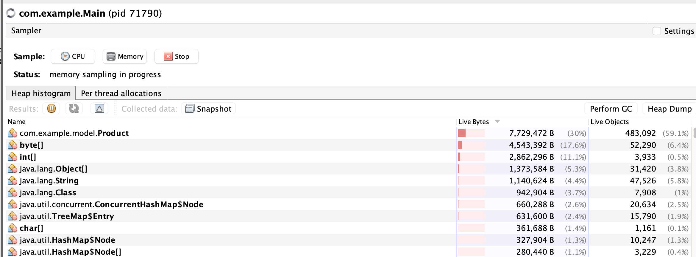

* 프리미티브, 스트링 같은 기본 자바 객체는 중요하지 않음. 
* 샘플링한 데이터를  Live Bytes 열의 내림차순(desc)로 정렬하여 메모리를 가장 많이 차지한 객체를 찾는다. 

샘플링으로 실마리를 찾았다. 이제 어느 코드가 문제가 될까? 이것을 프로파일링으로 찾을 수 있다.

* 프로파일링 수행시 대상이 무엇인지 알아야 하므로 항상 샘플링부터 시작하는것.

Product 타입을 대상으로 프로파일링을 수행한다. 

1. Profiler 탭 접속 
2. 프로파일러에 Memorysetggins -> 메모리 대상 객체인 com.example.model.Product를 대상으로 입력하여 지정 

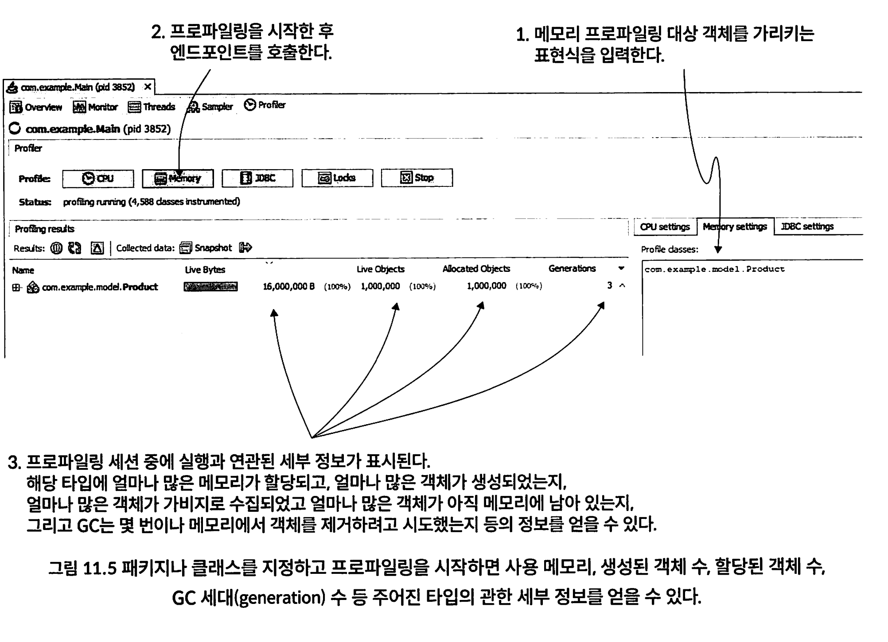

라이브 객체(현재 살아있는)외에도 총 인스턴스 수와 GC에서 생존한 횟수까지 알 수 이다. 

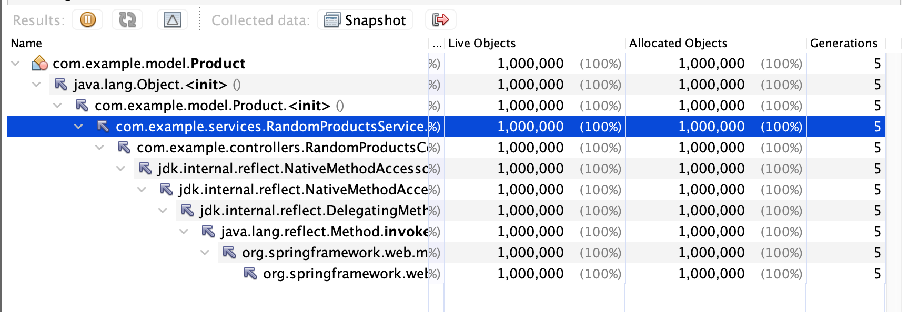

### 11.2 힙 덤프를 수집하여 메모리 누수가 발생하는 곳 찾기

앱 크래시가 발생되어 중단된 상태면 프로파일링 하기가 어렵다.

앱 크래시 시점에 힙 메모리 스냅숏을 찍은 힙 덤프를 이용할 수 있다.

#### 11.2.1 힙 덤프 수집

힙덤프는 세가지 방법으로 가져올 수 있다. 

- 메모리 이슈 때문에 앱 크래시가 발생할 때 미리 지정된 위치에서 힙 덤프를 자동 생성하도록 설정한다.
- 프로파일링 도구(예: VisualvM)를 사용한다.
- 커맨드 라인 도구(예: jcmd 또는 jmap)를 사용한다.


프로그래밍 방식으로도 얻을 수 있다.

HotSpotDiagnosticMXBean 클래스를 사용해서 힙 덤프를 생성할 수 있다.

http://localhost:8080/jmax/heapDump?file=dump.hprof 호출

```java
@RestController()
@RequestMapping("jmx")
public class JmxController {

  private final JmxService jmxService;

  public JmxController(JmxService jmxService) {
    this.jmxService = jmxService;
  }

  @GetMapping("heapDump")
  public void dumpHeap(@RequestParam("file") String outputFile) {
    if (outputFile == null || outputFile.isBlank()) {
      throw new IllegalArgumentException("'file' argument must not be blank.");
    }

    jmxService.dumpHeap(outputFile, true);
  }

}

import org.springframework.stereotype.Service;
import java.io.File;
import java.io.IOException;
import java.lang.management.ManagementFactory;
import com.sun.management.HotSpotDiagnosticMXBean;
import org.apache.logging.log4j.LogManager;
import org.apache.logging.log4j.Logger;

@Service
public class JmxService {

  private static final Logger LOGGER = LogManager.getLogger(JmxService.class);
  private static final String HOTSPOT_BEAN_NAME = "com.sun.management:type=HotSpotDiagnostic";
  private HotSpotDiagnosticMXBean mbean;

  public void dumpHeap(String outputFile, boolean live) {
    try {
      if (mbean == null) {
        mbean = ManagementFactory.newPlatformMXBeanProxy(
            ManagementFactory.getPlatformMBeanServer(),
            HOTSPOT_BEAN_NAME,
            HotSpotDiagnosticMXBean.class);
      }

      String myFile = outputFile.endsWith(".hprof") ? outputFile : outputFile + ".hprof";
      mbean.dumpHeap(myFile, live);

      if (!outputFile.equals(myFile)) {
        new File(myFile).renameTo(new File(outputFile));
      }
    } catch (IOException e) {
      LOGGER.error("Failed to dump heap to file: " + outputFile, e);
      throw new RuntimeException("Heap dump failed", e);
    }
  }
}
```


### 커맨드라인으로 힙 덤프 수집

1. 힙 덤프를 가져올 실행 중인 앱의 프로세스 ID(PID)를 찾는다.
2. jmap으로 힙 덤프 파일을 저장한다.

실행 중인 프로세스 ID(PID)는 jps로 찾는다.

```
jps -l
25320 main.Main
132 jdk.jcmd/sun.tools.jps.Jps
25700 org. jetbrains.jps.cmdline.Launcher
```

다음으로 jmap 커맨드에 PID와 힙 덤프 파일을 저장할 위치를 지정한다. 이때 -dump: format-b 인 수를 추가하여 아웃풋을 바이너리 파일로 지정한다

```
jmap -dump:format=b, file=/Users/ysk/dump/heapdump.bin <<PID>>
```


### 힙 덤프 자동 생성

JVM 시작시 인수를 전달할 수 있다.

```java
-XX:+HeapDumpOnOutOfMemoryError
-XX:HeapDumpPath=heapdump.bin

java -jar -XX:+HeapDumpOnOutOfMemoryError -XX:HeapDumpPath=heapdump.bin app.jar
```

* 상대경로 지정시에 앱을 실행한 유저에 쓰기 권한을 부여해야 한다
* `-XX:+HeapDumpOnOutOfMemoryError`: OutOfMemoryError가 발생했을 때 힙 덤프를 생성하도록 설정합니다.
* `-XX:HeapDumpPath=heapdump.bin`: 생성된 힙 덤프 파일의 경로를 지정합니다

### EC2, Lightsale, ECS 힙 덤프

먼저 Dockerfile에 힙 덤프 경로를 

```
FROM openjdk:11-jre-slim
COPY your-app.jar /app.jar
CMD ["java", "-XX:+HeapDumpOnOutOfMemoryError", "-XX:HeapDumpPath=/tmp/heapdump.hprof", "-jar", "/app.jar"]
```

EC2 인스턴스에서 Docker 컨테이너를 실행할 때:

```
docker run -d --name your-app-container -v /path/on/host:/tmp your-app-image
```

이렇게 하면 힙 덤프 파일이 `/path/on/host/heapdump.hprof`에 생성

ECS Task Definition에서 호스트 디렉토리를 마운트하도록 설정

```json
{
  "containerDefinitions": [
    {
      "name": "your-app-container",
      "image": "your-app-image",
      "mountPoints": [
        {
          "sourceVolume": "heapdump-volume",
          "containerPath": "/tmp"
        }
      ],
      "essential": true
    }
  ],
  "volumes": [
    {
      "name": "heapdump-volume",
      "host": {
        "sourcePath": "/path/on/host"
      }
    }
  ]
}

```

Fargate는 서버리스 환경이므로 EC2 인스턴스처럼 호스트 디렉토리에 직접 접근할 수 없어 AWS S3와 같은 외부 스토리지를 사용하여 힙 덤프 파일을 저장.

#### 1. S3 버킷 생성

먼저 힙 덤프 파일을 저장할 S3 버킷을 생성합니다.

#### 2. 컨테이너에 AWS CLI 설치 및 IAM 역할 설정

Dockerfile에 AWS CLI를 설치하고, 힙 덤프 파일을 S3에 업로드하는 스크립트를 작성

```dockerfile
FROM openjdk:11-jre-slim
COPY your-app.jar /app.jar
RUN apt-get update && apt-get install -y awscli
COPY upload-heapdump.sh /upload-heapdump.sh
RUN chmod +x /upload-heapdump.sh
CMD ["java", "-XX:+HeapDumpOnOutOfMemoryError", "-XX:HeapDumpPath=/tmp/heapdump.hprof", "-jar", "/app.jar"]
```

#### 업로드 스크립트 작성

컨테이너가 종료될 때 힙 덤프 파일을 S3에 업로드하는 스크립트를 작성

```sh
#!/bin/sh
java -XX:+HeapDumpOnOutOfMemoryError -XX:HeapDumpPath=/tmp/heapdump.hprof -jar /app.jar
aws s3 cp /tmp/heapdump.hprof s3://your-bucket-name/heapdump.hprof
```

Task Definition에서 적절한 IAM 역할을 설정하여 컨테이너가 S3에 접근

```json
{
  "containerDefinitions": [
    {
      "name": "your-app-container",
      "image": "your-app-image",
      "essential": true,
      "logConfiguration": {
        "logDriver": "awslogs",
        "options": {
          "awslogs-group": "/ecs/your-app",
          "awslogs-region": "us-west-2",
          "awslogs-stream-prefix": "ecs"
        }
      }
    }
  ],
  "executionRoleArn": "arn:aws:iam::your-account-id:role/your-ecs-execution-role"
}

```


## 힙덤프 예제

예시 프로젝트 ch11-ex2에서 다음 VM 옵션으로 실행

```
-XX:+HeapDumpOnOutOfMemoryError -XX:HeapDumpPath=heapdump.bin -Xmx100m
```

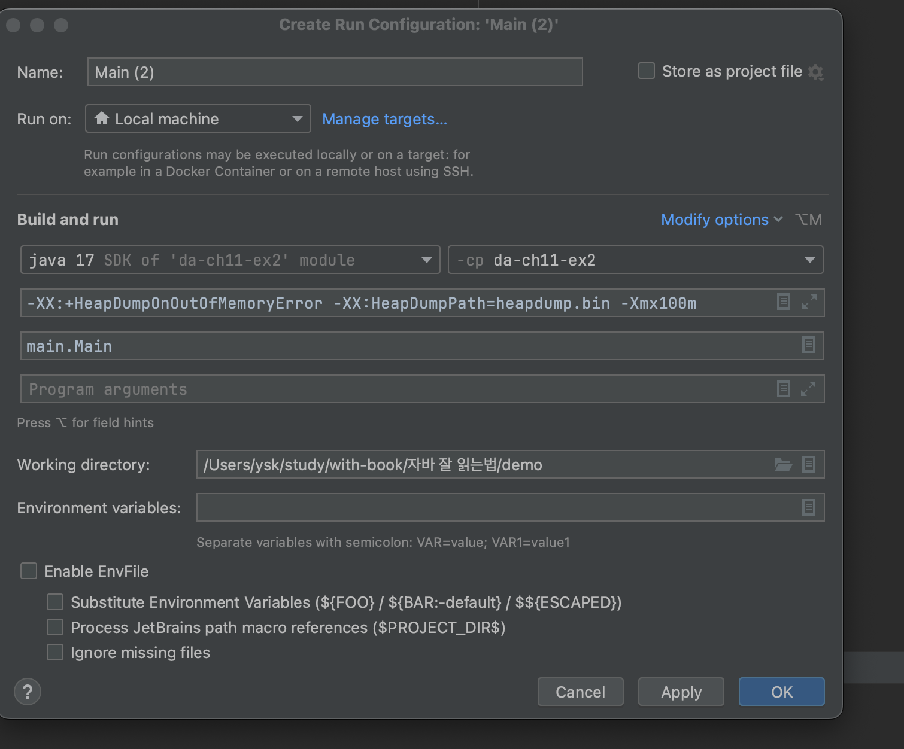

프로젝트 폴더를 보면 앱 크래시가 일어난 순간 힙에 존재했던 데이터의 모든 세부 정보가 기록된 heapdump.bin 파일이 있다. VisualVM에서 이 파일을 열어 분석하면 된다

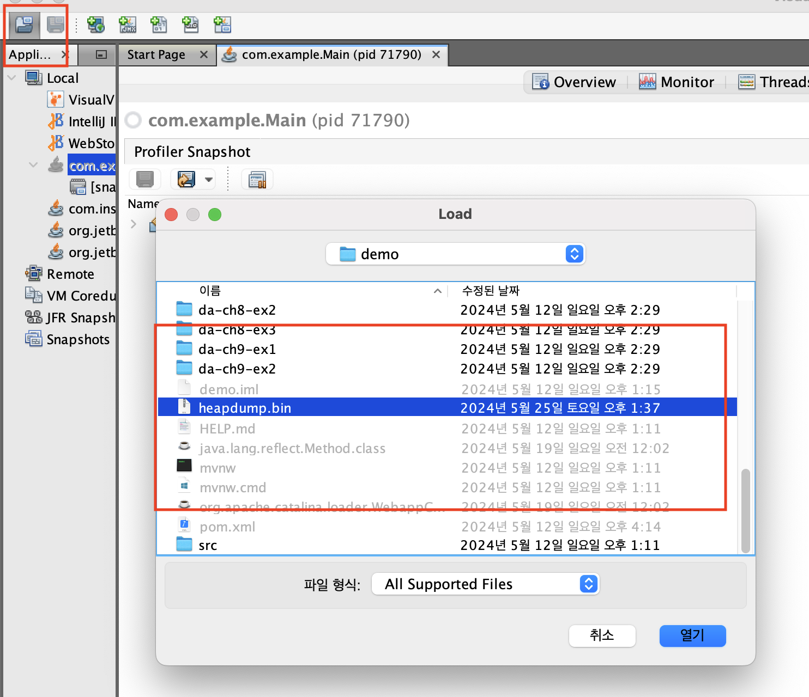


#### 11.2.2 힙 덤프 읽는 방법

VisualVM에서 힙 덤프 파일을 열면 우측 탭에 힙 덤프 요약 정보가 나온다(

* 암호화되지 않은 모든정보, 파일 크기, 총 클래스 개수, 인스턴스 개수 등 

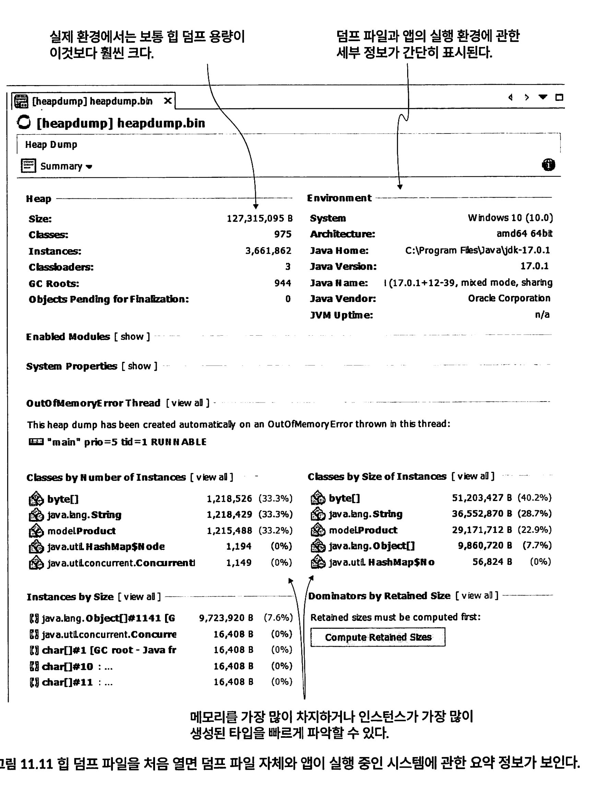

Heap Dump 탭의 좌측 상단 모서리의 드롭다운 메뉴에서 Obiects를 선택하면 힙 덤프에 존재하는 객체 인스턴스를 조사할 수 있다

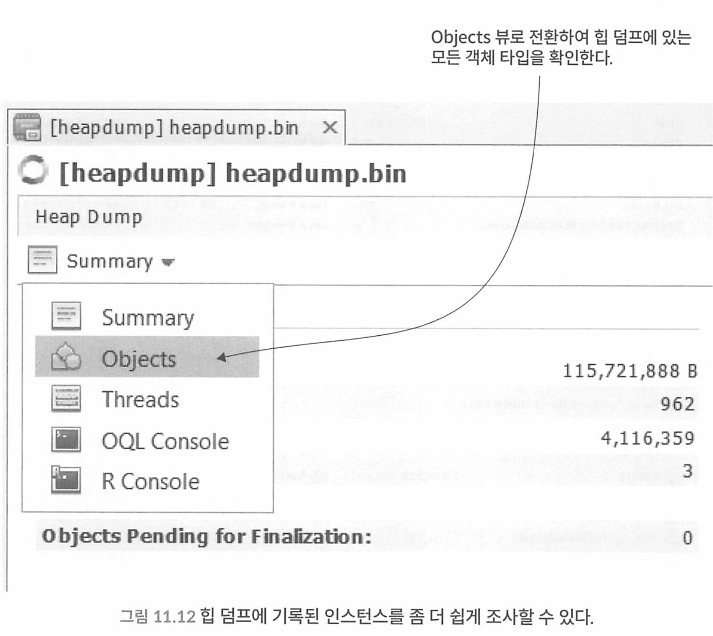

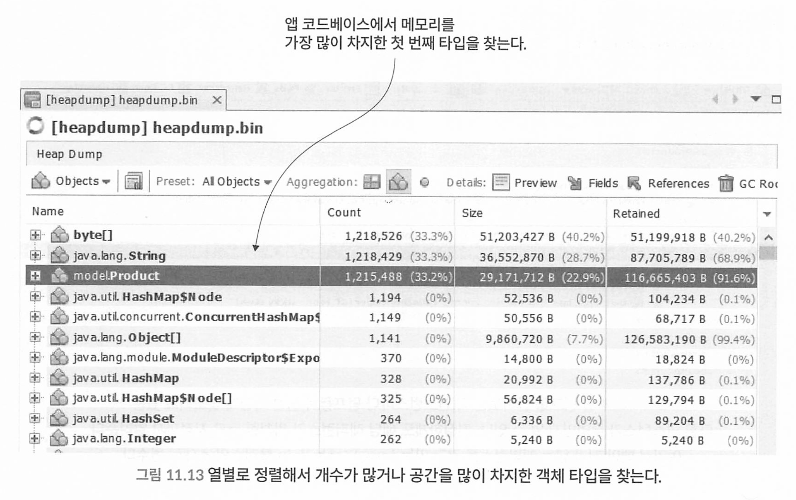

각 행 좌측에 있는 [+] 버튼을 클릭하면 해당 타입 인스턴스의 세부 정보를 펼쳐볼 수 있다. 이미 백만 개가 넘는 인스턴스가 생성되었다는 사실은 알고 있지만 다음과 같은 정보도 필요하다.

- 어떤 코드가 이 타입의 인스턴스를 마구 찍어내는가?
- GC는 왜 이 타입의 인스턴스를 메모리에서 제때 비우지 못하는가?

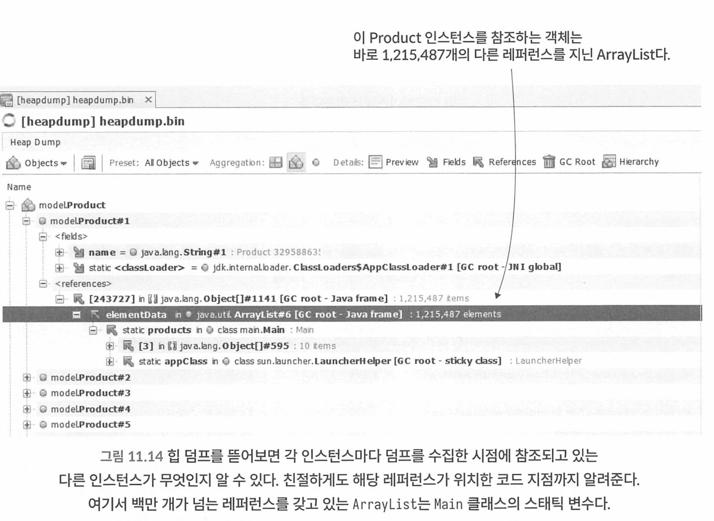

#### 11.2.3 OQL 콘솔에서 힙 덤프 쿼리

Visual VM에서 객체 쿼리 언어인 OQL로 힙덤프를 조사할 수 있따.

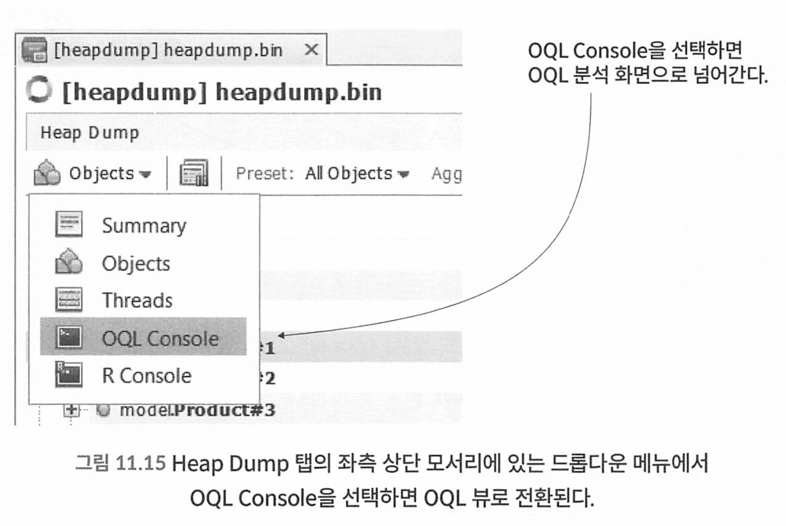

```
select p from model.Product.p
```

* OQL에서는 항상 select, from, where 등의 키워드는 소문자로, 타입은 FQN(패키지 + 클래스명) 포맷으로 기재 한다.

* 용량이 4기가 이상인데 덤프 파일의 OQL 속도는 매우 느리다 

\+ 버튼을 클릭하면 인스턴스에 관한 세부정보를 볼 수 있다.

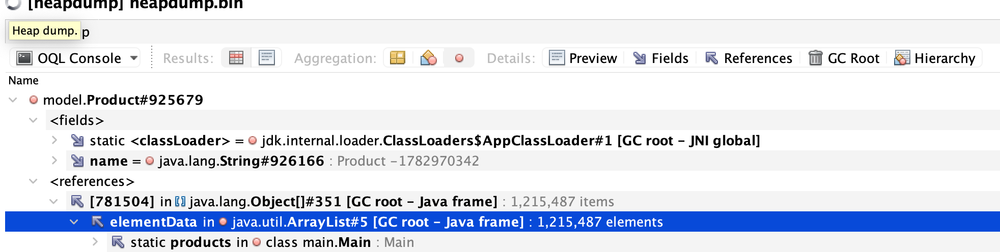

* 메인 클래스의 products ArrayList에서 참조중. 

가령 이름이 15자 이상인 인스턴스만 선택하려면? 

```
select { name: p.name, name_length: p.name. value. length} from model.Product p
where p. name. value. length > 15
```

이처럼 00L의 내장 기본 함수를 활 용하면 여러 가지 유용한 작업을 수행할 수 있다.

- 인스턴스 레프리(instance refree) 쿼리: 앱이 메모리 누수를 유발하는지 알 수 있다.
- 인스턴스 참조(instance referral) 쿼리: 어떤 인스턴스가 메모리 누수의 원인인지 알 수 있다.
- 인스턴스에서 중복 찾기: 어떤 기능이 메모리를 덜 사용하도록 최적화할 수 있는지 알 수 있다.
- 특정 인스턴스의 서브클래스(subclass) 및 슈퍼클래스(superclass) 찾기: 소스 코드를 안 봐도 앱의 클래스가 어떻게 설계됐는지 인사이트(insight)를 얻을 수 있다.
- 긴 수명 경로(ife path) 찾기: 메모리 누수를 식별하는 데 유용하다.

다음은 Product 타입의 인스턴스를 참조하는 모든 유니크한 레퍼러를 조회하는 쿼리다.
```
select unique(referrers (p)) from model.Product p
```