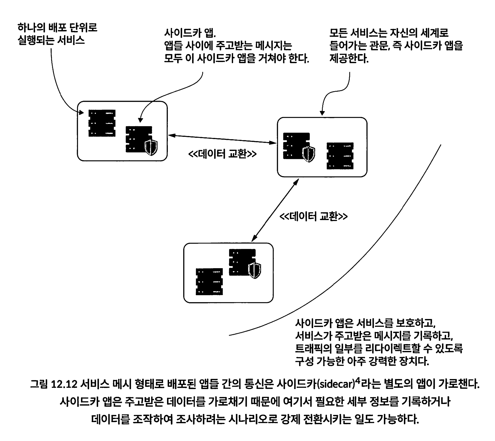
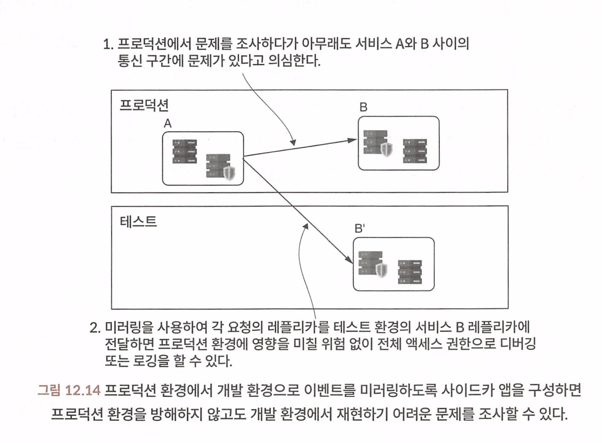

## CHAPTER 12 대규모 시스템에 배포된 앱의 동작 조사하기

### 12.1 서비스 간 통신 문제 조사

#### 12.1.1 HTTP 서버 프로브로 HTTP 요청 관찰

#### 12.1.2 HTTP 클라이언트 프로브로 앱이 보낸 HTTP 요청 관찰

#### 12.1.3 소켓의 로 레벨 이벤트 조사

소켓은 앱이 다른 프로세스와 통신하기 위한 관문이다. 통신이 체결되면 다음과 같은 소켓 이벤트 가 발생한다(그림 12.6).

1. 소켓을 열고 통신을 체결한다(즉, 데이터를 주고받을 앱과 핸드셰이크(handshake)한다).
2. 소켓을 통해 읽거나(데이터 수신) 쓴다(데이터 송신).
3. 소켓을 닫는다.

### 12.2 통합 로그 모니터링의 중요성

Sentry 무료플랜이 있다. 

* https://sentry.io/welcome/?utm_source=google&utm_medium=cpc&utm_id=%7B20403208976%7D&utm_campaign=Google_Search_Brand_SentryKW_ROW_Alpha&utm_content=g&utm_term=sentry&gad_source=1&gclid=CjwKCAjw9cCyBhBzEiwAJTUWNZ3PEcj5GM9z5ErlSFM53Q3JFT1AUXs465RYs0WlxVKYtGKOYHhbhxoC-bAQAvD_BwE

연동 절차는 다음과 같이 간단하다.

1. 센트리에 가입하여 계정을 새로 만든다.
2. 새 프로젝트(모니터링하려는 앱이 있는 프로젝트)를 추가한다.
3. 센트리가 제공하는 프로젝트 데이터 소스명(DSN) 주소를 수집한다.
4. 프로젝트에 DSN 주소를 설정한다.

### 12.3 배포 도구를 조사에 활용하는 법

서비스 메시 : 시스템의 여러 앱이 서로 통신하는 방식을 제어하는 수단.

앱 실행을 조사할 때 서비스 메시 는 크게 다음 두 가지 측면에서 도움을 준다.

- 결함 주입(Fault injection): 조사할 시나리오를 재현하기 위해 앱 통신을 일부러 실패하게 만드는방법
- 미러링(mirroring): 프로덕션 환경에서 테스트 환경으로 앱을 복제하여 조사하는 방법

* 서비스 메시는 일반적으로 서비스 디스커버리, 로드 밸런싱, 암호화된 통신, 인증 및 권한 부여, 모니터링, 트래픽 관리 등을 포함한 다양한 기능을 제공

#### 12.3.1 결함 주입으로 재현하기 곤란한 문제를 비슷하게 모방

결함 주입 : 테스트 환경에서 재현할 방법이 마땅치 않은 동작을 일부러 시스템에 장애를 일으켜 재현하는것 

다음과 같은 경우 환경에서 재연 및 문제 찾기가 어려워진다.

- 잘못된 기기탓에 네트워크 장애가 발생한다.
- 앱이 설치된 곳에서 실행 중인 일부 시스템 소프트웨어 때문에 전체 환경에 걸쳐 결함이 발생하거나 불안정해진다.

네트워크, 인프라는 100% 신뢰할 수 없다.

문제가 불거진 출발점이 어디인지 조사하고 조치할 수 있는 방안을 나 름대로 준비해야 한다.

서비스 메시 체제에서는 사이드카 앱이 앱 간의 통신을 관장하므로 일부러 사이드카 앱을 컨트롤하여 통신 장애를 시뮬레이션 할 수 있따. 

#### 12.3.2 미러링 기법을 테스트 및 에러 감지에 활용

미러링은 사이드카 앱을 자신이 통신하는 앱의 레플리카(replica, 복제본)에 실제 서비스가 보내는 것과 동일한 요청의 레플리카를 전송하도록 구성하는 기법이다. 이 레플리카는 테스트 용도로 사 용하는 것과 전혀 다른 환경에서 실행할 수 있으므로 테스트 환경에서 실행 중인 앱을 사용하여 서비스 간 통신을 디버깅하거나 프로파일링할 수 있다

